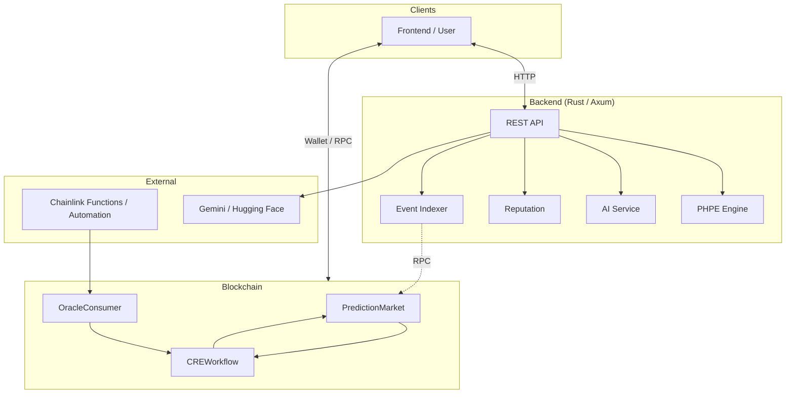

# PraesagiumChain

Decentralized prediction markets powered by **Chainlink CRE**, AI (Gemini), multi-source data (Binance, Chainlink, X, Reddit), and Solidity smart contracts.

---

## Overview

PraesagiumChain implements trustless market resolution via Chainlink: off-chain data and AI sentiment drive on-chain outcomes through the CRE (Request & Execution) workflow. The backend fuses time-series predictions (PHPE), sentiment analysis, and price feeds into a single hybrid API.



---

## Why PraesagiumChain is different

- **Calibrated uncertainty (PHPE)** — Users see not only a probability (Yes/No) but also an **uncertainty** band from a dedicated time-series + Bayesian engine, so they can gauge confidence before betting.
- **Single CRE layer for all sources** — Resolution can come from AI sentiment (Gemini), Chainlink Price Feeds, Binance, sports/weather APIs, or time-series predictions—all through one Chainlink CRE workflow.
- **Modular on-chain design** — Conditional, private, and tokenized (NFT) markets plus a reputation system are designed as extensions; the base protocol stays simple and gas-efficient.

---

## Tech stack

| Layer | Technologies |
|-------|----------------|
| **Smart contracts** | Solidity, OpenZeppelin, Chainlink (Functions, CRE) |
| **Tooling** | Hardhat, Node.js |
| **Backend** | Rust, Axum, PHPE engine, PostgreSQL (Supabase) |
| **AI / Data** | Gemini, Hugging Face; Binance, Chainlink price feeds |
| **Frontend (optional)** | See [docs/development.md](docs/development.md) (Supabase, env in `config/frontend.env.example`) |

---

## Chainlink Integration

This project follows [Chainlink Prediction Markets](https://chain.link/community/hackathon) guidelines:

- **AI-powered settlement** — Gemini / Hugging Face for sentiment; outcome (0/1) fed to CRE.
- **Event-driven resolution** — OracleConsumer → CREWorkflow → `resolveMarket`.
- **CRE Workflow** as the on-chain orchestration layer.
- **Blockchain + external API + LLM** — Backend calls Binance, Chainlink proxy, and AI services.

| Component | Purpose |
|-----------|---------|
| `contracts/CREWorkflow.sol` | CRE orchestration; receives oracle outcome, resolves market |
| `contracts/OracleConsumer.sol` | Generic callback → CREWorkflow (simulation / Any API) |
| `contracts/PredictionMarketFunctionsConsumer.sol` | Chainlink Functions client; `fulfillRequest` → CREWorkflow |
| `contracts/PredictionMarket.sol` | Binary markets (Yes/No), bets, payouts |
| `scripts/deploy/deployLocal.js` | Deploy PM, CRE, OracleConsumer (local) |
| `scripts/deploy/deployWithFunctions.js` | Deploy with Functions Consumer when `FUNCTIONS_ROUTER` is set |
| `scripts/simulateCRE.js` | CRE flow simulation (Node; optional: with backend for outcome) |
| `scripts/inputs.json` | Example inputs for simulation (marketId, text_to_analyze, etc.) |
| `backend-rust/scripts/ai/sentiment-analysis.js` | Sentiment script for Chainlink Functions (returns 0/1) |
| `backend-rust/src/services/sources/chainlink.rs` | Chainlink price source (e.g. ETH/USD) |

**CRE flow simulation**

- **With Node (local):** `node scripts/simulateCRE.js`. Optional: `API_BASE_URL=http://localhost:4000` when the backend is running; the script calls `/api/ai/sentiment` to get the outcome and simulates the Report step.
- **With Chainlink CRE CLI:** Define a workflow in a directory with `workflow.yaml` and run `cre workflow simulate <workflow-path>`. See [docs/development.md](docs/development.md) (CRE simulation) and [Simulating Workflows](https://docs.chain.link/cre/guides/operations/simulating-workflows). Example inputs in `scripts/inputs.json`.

---

## Data Sources

| Source | Role |
|--------|------|
| **Binance** | 24h price (BTCUSDT, ETHUSDT, etc.) |
| **Chainlink** | ETH/USD proxy (production Data Feed) |
| **X / Reddit** | Text → AI sentiment (Gemini) |
| **PHPE** | Time-series prediction engine |

---

## Quick Start

**Contracts (local network)**

1. In one terminal, start the Hardhat local node (keep it running):
   ```bash
   npm run node
   ```
   or `npx hardhat node`.

2. In another terminal, compile and deploy:
   ```bash
   npm install && npx hardhat compile
   npm run deploy
   ```
   or `npx hardhat run scripts/deploy/deployLocal.js --network localhost`.

3. Simulate the CRE flow:
   ```bash
   node scripts/simulateCRE.js
   ```

**Backend**

```bash
cp config/env.example .env   # fill DATABASE_URL (Supabase) and other values
cd backend-rust && cargo run
```

Use the **Session pooler** connection string from Supabase (Dashboard → Connect → Session pooler) if you are on an IPv4-only network (e.g. WSL). See [backend-rust/README.md](backend-rust/README.md) and [docs/development.md](docs/development.md) § 2.2.

To apply the schema to Supabase from the terminal (with the project linked): `npm run db:push`.


**Frontend & Supabase** — See [docs/development.md](docs/development.md) for env vars and [docs/frontend-project.md](docs/frontend-project.md) for the **frontend project brief** (tasks, stack, and API/contract integration for your teammate).

---

## API (Backend)

| Method | Path | Purpose |
|--------|------|---------|
| POST | `/api/ai/sentiment` | Sentiment (Gemini) |
| POST | `/api/predict` | PHPE prediction from time series |
| POST | `/api/predict/hybrid` | Hybrid: series + sentiment + Binance/Chainlink |

**Example — hybrid (sentiment + Binance)**

```bash
curl -X POST http://localhost:4000/api/predict/hybrid \
  -H "Content-Type: application/json" \
  -d '{"sentiment_text":"Bitcoin going up","binance_symbol":"BTCUSDT"}'
```

**Example — hybrid (social + Chainlink price)**

```bash
curl -X POST http://localhost:4000/api/predict/hybrid \
  -H "Content-Type: application/json" \
  -d '{"social_texts":["Bitcoin bullish from X"],"use_chainlink_price":true,"market_id":1}'
```

---

## Repository structure

Aligned with common Web3 hackathon layout (see [web3-hackathon-starter](https://github.com/envoy1084/web3-hackathon-starter), [HackQuest best practices](https://www.hackquest.io/blog/Best-Practices-for-Successful-Web3-Hackathon-Project-Submissions)):

```
PraesagiumChain/
├── config/                 # Env templates (backend + frontend)
│   ├── env.example         # Backend: copy to .env
│   └── frontend.env.example
├── contracts/              # Solidity (OpenZeppelin, Chainlink)
│   ├── interfaces/
│   ├── PredictionMarket.sol
│   ├── CREWorkflow.sol
│   ├── OracleConsumer.sol
│   └── PredictionMarketFunctionsConsumer.sol
├── scripts/
│   ├── deploy/            # Hardhat deploy (local + testnet)
│   ├── test/              # Contract tests
│   ├── simulateCRE.js     # CRE flow simulation
│   └── inputs.json        # Example inputs
├── backend-rust/          # REST API (Rust, Axum), PHPE engine, AI
│   ├── phpe/              # Prediction engine
│   ├── scripts/ai/        # Chainlink Functions scripts
│   └── src/
├── cre/                   # Chainlink CRE workflow (CRE CLI)
├── docs/
│   ├── architecture.md    # System design, contracts, CRE, PHPE, security
│   ├── development.md    # API, setup, CRE simulation, testnet deploy, demo, automation
│   └── submission.md     # Hackathon checklist, deployed contracts, winning ideas
├── supabase/              # Schema & migrations
├── package.json           # Hardhat, scripts
└── README.md
```

---

## Hackathon & best practices

This project follows the [Chainlink Prediction Markets Hackathon](https://chain.link/community/hackathon) guidelines (CRE workflow, Chainlink Functions, simulation, documentation).

For a **submission-ready checklist** (contract address, testnet, Scan URL, demo video, live link), see **[docs/submission.md](docs/submission.md)**. References:

- [HackQuest – Best practices for Web3 hackathon submissions](https://www.hackquest.io/blog/Best-Practices-for-Successful-Web3-Hackathon-Project-Submissions) — documentation, testnet deployment, Scan URL, demo video, GitHub.
- [Hackathon 101 – Survival guide (Medium)](https://medium.com/@BizthonOfficial/hackathon-101-the-ultimate-survival-guide-for-first-time-web3-developers-4f3d51fbab0d) — MVP, deploy frontend (Vercel/Netlify), clear README, demo script.
- [web3-hackathon-starter](https://github.com/envoy1084/web3-hackathon-starter) — repo structure, env setup, tech stack.

**Before submitting:** deploy contracts on the **correct testnet** (see [docs/development.md](docs/development.md) § Deploy and verify on testnet), add contract addresses and Scan URLs to [README](#deployed-contracts) and [docs/submission.md](docs/submission.md), and record a short **demo video** (2–5 min). For a scriptable E2E demo without UI, see [docs/development.md](docs/development.md) § Demo vertical. Testnet ETH: [Sepolia faucets](https://sepoliafaucet.com) · [Polygon Amoy](https://faucet.polygon.technology).

## Deployed contracts

When you deploy to a public network (Sepolia, Polygon, etc.), add addresses and **Scan URLs** here and in [docs/submission.md](docs/submission.md):

| Contract | Network | Address | Explorer |
|----------|---------|---------|----------|
| PredictionMarket | — | — | [Etherscan](https://sepolia.etherscan.io/address/) / [Polygonscan](https://polygonscan.com/address/) |
| CREWorkflow | — | — | — |
| OracleConsumer | — | — | — |
| PredictionMarketFunctionsConsumer | — | — | (only if using `deployWithFunctions.js`) |

Example: `PredictionMarket | Sepolia | 0x1234... | [View](https://sepolia.etherscan.io/address/0x1234...)`.

## Documentation

| Document | Contents |
|----------|----------|
| **[docs/architecture.md](docs/architecture.md)** | System architecture, smart contracts, CRE workflow (Compute-Report-Evaluate), PHPE engine, data flows, security. |
| **[docs/development.md](docs/development.md)** | API reference, configuration, setup, CRE simulation, testnet deploy and verify, demo vertical, Chainlink Automation, contributing. |
| **[docs/submission.md](docs/submission.md)** | Hackathon checklist, deployed contracts table, testnet faucets, demo video, winning ideas summary. |
| **[docs/frontend-project.md](docs/frontend-project.md)** | Frontend project brief: tasks, stack, env, and API/contract integration for the frontend developer. |

---

## Authors

- **Jhuomar Boskoll Quintero**
- **Querube Yuneth Ariza Ríos**

## License

[Apache-2.0](LICENSE)
