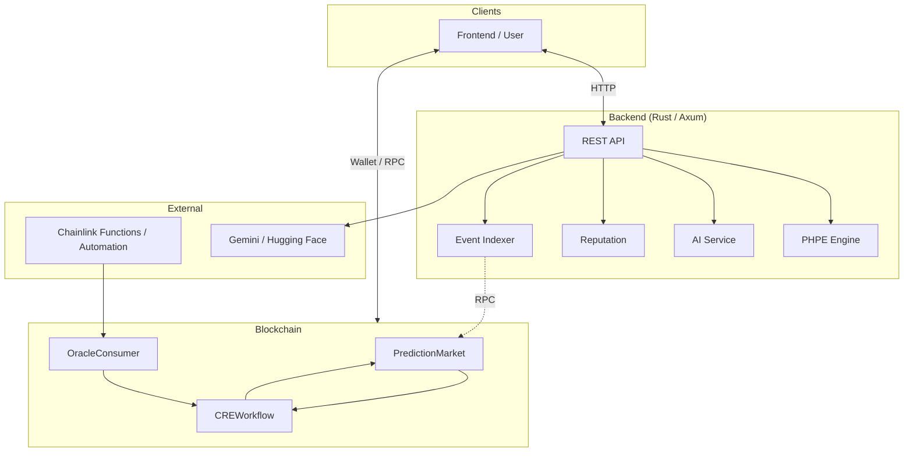

# PraesagiumChain

Decentralized prediction markets powered by **Chainlink CRE**, AI (Gemini), multi-source data (Binance, Chainlink, X, Reddit), and Solidity smart contracts.

---

## Overview

PraesagiumChain implements trustless market resolution via Chainlink: off-chain data and AI sentiment drive on-chain outcomes through the CRE (Request & Execution) workflow. The backend fuses time-series predictions (PHPE), sentiment analysis, and price feeds into a single hybrid API.



---

## Chainlink Integration

This project follows [Chainlink Prediction Markets](https://chain.link/community/hackathon) guidelines:

- **AI-powered settlement** — Gemini / Hugging Face for sentiment; outcome (0/1) fed to CRE.
- **Event-driven resolution** — OracleConsumer → CREWorkflow → `resolveMarket`.
- **CRE Workflow** as the on-chain orchestration layer.
- **Blockchain + external API + LLM** — Backend calls Binance, Chainlink proxy, and AI services.

| Component | Purpose |
|-----------|---------|
| `contracts/CREWorkflow.sol` | CRE orchestration; receives oracle outcome, resolves market |
| `contracts/OracleConsumer.sol` | Generic callback → CREWorkflow (simulation / Any API) |
| `contracts/PredictionMarketFunctionsConsumer.sol` | Chainlink Functions client; `fulfillRequest` → CREWorkflow |
| `contracts/PredictionMarket.sol` | Binary markets (Yes/No), bets, payouts |
| `scripts/deploy/deployLocal.js` | Deploy PM, CRE, OracleConsumer (local) |
| `scripts/deploy/deployWithFunctions.js` | Deploy with Functions Consumer when `FUNCTIONS_ROUTER` is set |
| `scripts/simulateCRE.js` | CRE flow simulation (Node; optional: with backend for outcome) |
| `scripts/inputs.json` | Example inputs for simulation (marketId, text_to_analyze, etc.) |
| `backend-rust/scripts/ai/sentiment-analysis.js` | Sentiment script for Chainlink Functions (returns 0/1) |
| `backend-rust/src/services/sources/chainlink.rs` | Chainlink price source (e.g. ETH/USD) |

**CRE flow simulation**

- **With Node (local):** `node scripts/simulateCRE.js`. Optional: `API_BASE_URL=http://localhost:4000` when the backend is running; the script calls `/api/ai/sentiment` to get the outcome and simulates the Report step.
- **With Chainlink CRE CLI:** Define a workflow in a directory with `workflow.yaml` and run `cre workflow simulate <workflow-path>`. See [docs/CRE_CLI.md](docs/CRE_CLI.md) and [Simulating Workflows](https://docs.chain.link/cre/guides/operations/simulating-workflows). Example inputs in `scripts/inputs.json`.

---

## Data Sources

| Source | Role |
|--------|------|
| **Binance** | 24h price (BTCUSDT, ETHUSDT, etc.) |
| **Chainlink** | ETH/USD proxy (production Data Feed) |
| **X / Reddit** | Text → AI sentiment (Gemini) |
| **PHPE** | Time-series prediction engine |

---

## Quick Start

**Contracts (local network)**

1. In one terminal, start the Hardhat local node (keep it running):
   ```bash
   npm run node
   ```
   or `npx hardhat node`.

2. In another terminal, compile and deploy:
   ```bash
   npm install && npx hardhat compile
   npm run deploy
   ```
   or `npx hardhat run scripts/deploy/deployLocal.js --network localhost`.

3. Simulate the CRE flow:
   ```bash
   node scripts/simulateCRE.js
   ```

**Backend**

```bash
cp config/env.example .env   # fill values
cd backend-rust && cargo run
```

**Frontend & Supabase** — See [docs/DEVELOPMENT.md](docs/DEVELOPMENT.md) for env vars, Supabase schema, and API base URL.

---

## API (Backend)

| Method | Path | Purpose |
|--------|------|---------|
| POST | `/api/ai/sentiment` | Sentiment (Gemini) |
| POST | `/api/predict` | PHPE prediction from time series |
| POST | `/api/predict/hybrid` | Hybrid: series + sentiment + Binance/Chainlink |

**Example — hybrid (sentiment + Binance)**

```bash
curl -X POST http://localhost:4000/api/predict/hybrid \
  -H "Content-Type: application/json" \
  -d '{"sentiment_text":"Bitcoin going up","binance_symbol":"BTCUSDT"}'
```

**Example — hybrid (social + Chainlink price)**

```bash
curl -X POST http://localhost:4000/api/predict/hybrid \
  -H "Content-Type: application/json" \
  -d '{"social_texts":["Bitcoin bullish from X"],"use_chainlink_price":true,"market_id":1}'
```

---

## Hackathon

This project follows the [Chainlink Prediction Markets Hackathon](https://chain.link/community/hackathon) guidelines (CRE workflow, Chainlink Functions, simulation, documentation).

## Deployed contracts

When you deploy to a public network (Sepolia, Polygon, etc.), add explorer links here:

| Contract | Network | Address | Explorer |
|----------|---------|---------|----------|
| PredictionMarket | — | — | [Etherscan](https://sepolia.etherscan.io/address/) / [Polygonscan](https://polygonscan.com/address/) |
| CREWorkflow | — | — | — |
| OracleConsumer | — | — | — |
| PredictionMarketFunctionsConsumer | — | — | (only if using `deployWithFunctions.js`) |

Example: `PredictionMarket | Sepolia | 0x1234... | [View](https://sepolia.etherscan.io/address/0x1234...)`.

## Documentation

| Document | Contents |
|----------|----------|
| **[docs/ARCHITECTURE.md](docs/ARCHITECTURE.md)** | System architecture, smart contracts, CRE workflow (Compute-Report-Evaluate), PHPE engine, data flows, security. |
| **[docs/DEVELOPMENT.md](docs/DEVELOPMENT.md)** | API reference, configuration, setup (backend, frontend, Supabase), contributing, feature guides. |
| **[docs/CRE_CLI.md](docs/CRE_CLI.md)** | CRE flow simulation and deployment (Node, CRE CLI, Chainlink Functions). |

---

## Authors

- **Jhuomar Boskoll Quintero**
- **Querube Yuneth Ariza Ríos**
