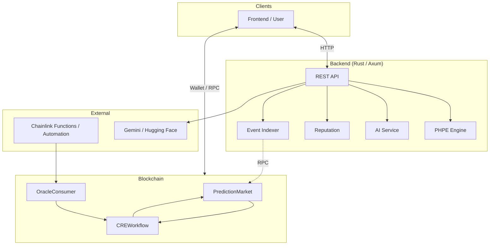
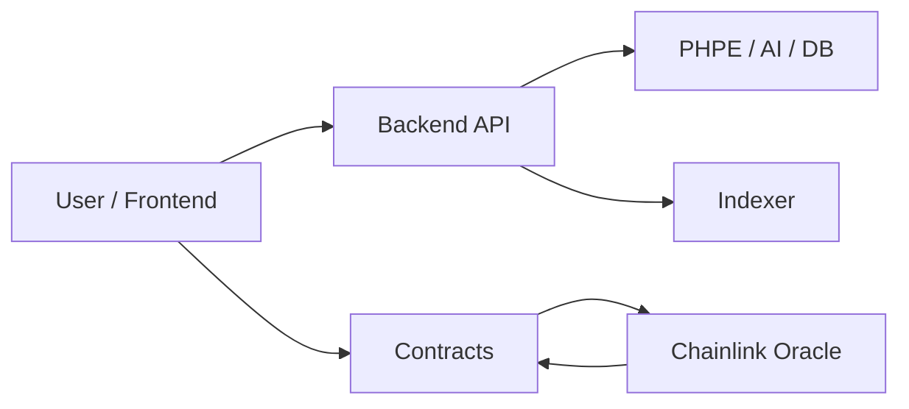
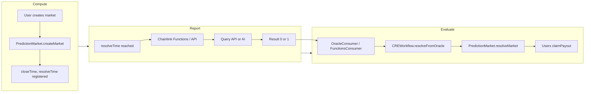
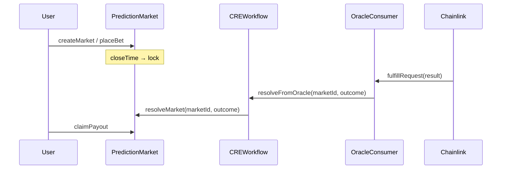
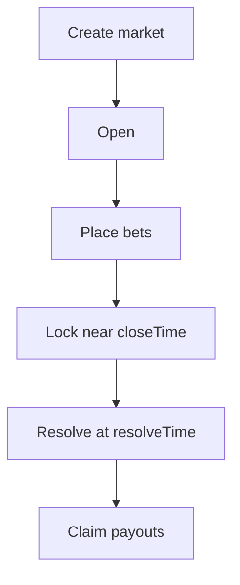

# PraesagiumChain

<p align="center">
  <strong>Decentralized Prediction Markets — Trustless Resolution via Chainlink CRE</strong><br>
  AI-Powered Settlement · PHPE Engine · Multi-Source Data · Solidity Smart Contracts
</p>

<p align="center">
  <a href="#overview"><strong>Overview</strong></a> •
  <a href="#what-makes-praesagiumchain-unique">Why Us</a> •
  <a href="#architecture">Architecture</a> •
  <a href="#quick-start">Quick Start</a> •
  <a href="#documentation">Docs</a>
</p>

<p align="center">
  
  
  
  
  
</p>

---

## Table of Contents

- [Overview](#overview)
- [What Makes PraesagiumChain Unique](#what-makes-praesagiumchain-unique)
- [Architecture](#architecture)
- [Tech Stack](#tech-stack)
- [Quick Start](#quick-start)
- [Configuration](#configuration)
- [Usage & Commands](#usage--commands)
- [API Reference](#api-reference)
- [Data Sources](#data-sources)
- [Chainlink Integration](#chainlink-integration)
- [Deployment](#deployment)
- [Project Structure](#project-structure)
- [Documentation](#documentation)
- [Hackathon Submission](#hackathon-submission)
- [License & Authors](#license--authors)

---

## Overview

**PraesagiumChain** is a decentralized prediction market platform that delivers trustless market resolution via Chainlink. Off-chain data (prices, weather, sports, news) and AI sentiment analysis drive on-chain outcomes through the **CRE (Compute – Report – Evaluate)** workflow.

The backend fuses time-series predictions (**PHPE** — Praesagium Hybrid Predictive Engine), AI sentiment (Gemini / Hugging Face), and price feeds (Binance, Chainlink) into a single hybrid API.



---

## What Makes PraesagiumChain Unique

| Differentiator | Description |
|----------------|-------------|
| **Calibrated Uncertainty (PHPE)** | Users see not only a probability (Yes/No) but also an **uncertainty band** from our dedicated time-series + Bayesian engine—so they can gauge confidence before betting. |
| **Single CRE Layer for All Sources** | Resolution can come from AI sentiment (Gemini), Chainlink Price Feeds, Binance, sports/weather APIs, or time-series predictions—**all through one Chainlink CRE workflow**. |
| **Modular On-Chain Design** | Conditional, private (commit-reveal), and tokenized (NFT) markets plus a reputation system, with a simple and gas-efficient base protocol. |
| **Private Prediction Markets** | Confidential Compute: commit-reveal bets with a dedicated CRE workflow for confidential resolution. |

---

## Architecture

### System Flow



### CRE Workflow (Compute – Report – Evaluate)



### Resolution Sequence



### Market Lifecycle



---

## Tech Stack

| Layer | Technologies |
|-------|--------------|
| **Smart Contracts** | Solidity 0.8.24, OpenZeppelin, Chainlink (Functions, CRE) |
| **Blockchain Tooling** | Hardhat, Node.js |
| **Backend** | Rust, Axum, PHPE engine, PostgreSQL (Supabase) |
| **AI / Data** | Gemini, Hugging Face; Binance, Chainlink, Cryptocompare, Kraken, etc. |
| **CRE Workflow** | TypeScript, Bun/Node |
| **Simulation** | Python (notebooks), Node.js |

---

## Quick Start

### Prerequisites

- **Node.js** 18+ and npm
- **Rust** 1.70+ (for backend)
- **PostgreSQL** (or Supabase account)
- **Hardhat** (installed via npm)

### Steps

1. **Clone and install**
   ```bash
   git clone https://github.com/quantumquirkz/PraesagiumChain.git
   cd PraesagiumChain
   npm install
   npx hardhat compile
   ```

2. **Configure environment**
   ```bash
   cp config/env.example .env
   # Edit .env with DATABASE_URL, GEMINI_API_KEY, PRIVATE_KEY, etc.
   ```

3. **Run locally**

   Terminal 1 — Hardhat node:
   ```bash
   npm run node
   ```

   Terminal 2 — Deploy contracts:
   ```bash
   npm run deploy
   ```

   Terminal 3 — Backend:
   ```bash
   npm run backend
   ```

4. **E2E Demo**
   ```bash
   npm run demo
   ```
   Flow: create market → bet → resolve (AI) → claim.

---

## Configuration

| Variable | Purpose |
|----------|---------|
| `DATABASE_URL` | PostgreSQL (Supabase). Prefer **Session pooler** on IPv4-only networks (e.g. WSL). |
| `GEMINI_API_KEY` | AI API for sentiment analysis |
| `PRIVATE_KEY` | Deployer key (Hardhat or wallet) |
| `RPC_URL` | Ethereum RPC (e.g. `http://127.0.0.1:8545` for Hardhat local) |
| `PREDICTION_MARKET_ADDRESS` | Contract address after deploy |
| `ORACLE_CONSUMER_ADDRESS` | OracleConsumer address after deploy |
| `CRE_WORKFLOW_ADDRESS` | CREWorkflow address after deploy |
| `API_BASE_URL` | Backend URL (e.g. `http://localhost:4000`) |

For the full list, see [docs/development-and-deployment.md](docs/development-and-deployment.md).

---

## Usage & Commands

| Command | Description |
|---------|-------------|
| `npm run node` | Start Hardhat local node |
| `npm run deploy` | Deploy contracts to localhost |
| `npm run deploy:private` | Deploy PrivatePredictionMarket |
| `npm run deploy:sepolia` | Deploy to Sepolia testnet |
| `npm run deploy:polygon` | Deploy to Polygon Amoy |
| `npm run backend` | Start Rust backend (port 4000) |
| `npm run demo` | Run E2E demo (create → bet → resolve → claim) |
| `npm test` | Run contract tests |
| `npm run test:backend` | Run backend tests |
| `npm run verify:sepolia` | Verify contracts on Etherscan |
| `npm run db:push` | Apply Supabase schema |

### CRE Simulation

**Node (local):**
```bash
node scripts/simulateCRE.js
```

**Chainlink CRE CLI:**
```bash
cd cre/praesagium-resolver && bun install
cd .. && cre workflow simulate praesagium-resolver --target staging-settings
```

---

## API Reference

| Method | Path | Purpose |
|--------|------|---------|
| GET | `/health` | Liveness |
| GET | `/api/metrics` | Prometheus-style metrics |
| POST | `/api/ai/sentiment` | Sentiment analysis (Gemini) |
| POST | `/api/predict` | PHPE prediction from time series |
| POST | `/api/predict/hybrid` | Hybrid: series + sentiment + Binance/Chainlink |
| GET | `/api/sources` | List available data sources |
| GET | `/api/sources/fetch?source=X&...` | Fetch from source |
| GET | `/api/markets` | List markets |
| GET | `/api/weather/rained` | Weather resolution (Open-Meteo) |
| GET | `/api/price/above` | Price ≥ threshold |
| GET | `/api/sports/winner` | Sports winner (API-Football) |

**Example — Cryptocompare:**
```bash
curl "http://localhost:4000/api/sources/fetch?source=cryptocompare&fsym=BTC&tsym=USD"
```

**Example — Hybrid (sentiment + Binance):**
```bash
curl -X POST http://localhost:4000/api/predict/hybrid \
  -H "Content-Type: application/json" \
  -d '{"sentiment_text":"Bitcoin going up","binance_symbol":"BTCUSDT"}'
```

---

## Data Sources

| Source | Role |
|--------|------|
| **Binance** | 24h price (BTCUSDT, ETHUSDT, etc.) |
| **Chainlink** | ETH/USD proxy (production Data Feed) |
| **Cryptocompare** | Crypto prices, 24h change |
| **Kraken** | Crypto prices (public API) |
| **Exchange Rate API** | Forex EUR/USD |
| **Finnhub** | Stocks/crypto (requires API key) |
| **NewsAPI** | News headlines (requires API key) |
| **CoinGecko** | Prices (price-above resolution) |
| **Open-Meteo** | Weather (weather-rained resolution) |
| **API-Football** | Sports (sports-winner resolution) |
| **X / Reddit** | Text → AI sentiment (Gemini) |
| **PHPE** | Time-series prediction engine |

---

## Chainlink Integration

This project follows [Chainlink Prediction Markets Hackathon](https://chain.link/community/hackathon) guidelines:

- **AI-powered settlement** — Gemini / Hugging Face for sentiment; outcome 0/1 fed to CRE
- **Event-driven resolution** — OracleConsumer → CREWorkflow → `resolveMarket`
- **CRE Workflow** as on-chain orchestration layer
- **Blockchain + External API + LLM** — Backend calls Binance, Chainlink proxy, and AI services
- **Private Prediction Markets (Confidential Compute)** — Commit-reveal bets; CRE workflow for confidential resolution

| Component | Purpose |
|-----------|---------|
| [contracts/CREWorkflow.sol](contracts/CREWorkflow.sol) | CRE orchestration; receives oracle outcome, resolves market |
| [contracts/OracleConsumer.sol](contracts/OracleConsumer.sol) | Generic callback → CREWorkflow |
| [contracts/PredictionMarket.sol](contracts/PredictionMarket.sol) | Binary markets, bets, payouts |
| [contracts/PrivatePredictionMarket.sol](contracts/PrivatePredictionMarket.sol) | Private markets (commit-reveal) |
| [cre/praesagium-resolver/](cre/praesagium-resolver/) | CRE workflow: CRON → HTTP `/api/ai/sentiment` → outcome |
| [cre/praesagium-resolver-confidential/](cre/praesagium-resolver-confidential/) | CRE workflow for Private markets |

---

## Deployment

### Local (development)
```bash
npm run node
npm run deploy
```

### Testnet (Sepolia / Polygon Amoy)

1. Configure `.env`: `PRIVATE_KEY`, `SEPOLIA_RPC_URL` (Alchemy recommended), `ETHERSCAN_API_KEY`
2. Get testnet ETH: [sepoliafaucet.com](https://sepoliafaucet.com) · [faucet.polygon.technology](https://faucet.polygon.technology)
3. Deploy: `npm run deploy:sepolia` or `npm run deploy:polygon`
4. Verify: `npm run verify:sepolia`

See [docs/deploy-testnet.md](docs/deploy-testnet.md) for a step-by-step guide.

### Deployed Contracts (Sepolia)

| Contract | Network | Address | Explorer |
|----------|---------|---------|----------|
| PredictionMarket | Sepolia | `0xf2397b5827860b361427240d1D1F6F89e9bF197f` | [View](https://sepolia.etherscan.io/address/0xf2397b5827860b361427240d1D1F6F89e9bF197f) |
| CREWorkflow | Sepolia | `0x3724BD048C11f50e01900061D8D50022A7c890c7` | [View](https://sepolia.etherscan.io/address/0x3724BD048C11f50e01900061D8D50022A7c890c7) |
| OracleConsumer | Sepolia | `0x153D088Eabb57b021503Aa1192F511B14e8819D8` | [View](https://sepolia.etherscan.io/address/0x153D088Eabb57b021503Aa1192F511B14e8819D8) |

---

## Project Structure

```
PraesagiumChain/
├── config/                     # Env templates
│   ├── env.example             # → root .env
│   └── frontend.env.example
├── contracts/                  # Solidity source
│   ├── PredictionMarket.sol
│   ├── CREWorkflow.sol
│   ├── OracleConsumer.sol
│   ├── PrivatePredictionMarket.sol
│   └── interfaces/
├── scripts/
│   ├── deploy/                 # deployLocal, deployPrivateMarket, deployWithFunctions
│   ├── demo/                   # E2E demo
│   ├── test/                   # Contract tests
│   ├── verify/                 # Etherscan verification
│   └── simulateCRE.js
├── backend-rust/               # REST API (Rust, Axum)
│   ├── phpe/                   # PHPE prediction engine
│   ├── scripts/ai/             # Chainlink Functions scripts
│   └── src/
├── cre/                        # Chainlink CRE workflow
│   ├── praesagium-resolver/
│   └── praesagium-resolver-confidential/
├── supabase/                   # Schema & migrations
├── notebook/                   # Simulation notebooks
└── docs/
```

---

## Documentation

| Document | Contents |
|----------|----------|
| [docs/architecture-and-design.md](docs/architecture-and-design.md) | Architecture, contracts, CRE, PHPE, repo structure |
| [docs/development-and-deployment.md](docs/development-and-deployment.md) | API, configuration, deployment, E2E demo, troubleshooting |
| [docs/deploy-testnet.md](docs/deploy-testnet.md) | Step-by-step testnet deployment |
| [docs/private-prediction-markets.md](docs/private-prediction-markets.md) | Private markets (Confidential Compute) |
| [docs/security-and-operations.md](docs/security-and-operations.md) | Security, optimization, CI/CD |
| [docs/frontend-project.md](docs/frontend-project.md) | Frontend brief: tasks, stack, API, contracts |
| [cre/README.md](cre/README.md) | CRE workflow setup and simulation |

---

## Hackathon Submission

This project follows the [Chainlink Prediction Markets Hackathon](https://chain.link/community/hackathon) guidelines.

**Submission-ready checklist** (contract address, testnet, Scan URL, demo video, live link): see [docs/development-and-deployment.md](docs/development-and-deployment.md) § 6.

**Demo (no UI):** `npm run demo` — create market → bet → resolve (AI) → claim.

**References:**
- [HackQuest – Best practices for Web3 hackathon submissions](https://www.hackquest.io/blog/Best-Practices-for-Successful-Web3-Hackathon-Project-Submissions)
- [Chainlink CRE – Simulating Workflows](https://docs.chain.link/cre/guides/operations/simulating-workflows)

---

## License & Authors

**License:** [Apache-2.0](LICENSE)

**Authors:**
- **Querube Yuneth Ariza Ríos**
- **Jhuomar Boskoll Quintero**

---

<p align="center">
  Built for the Chainlink ecosystem
</p>
