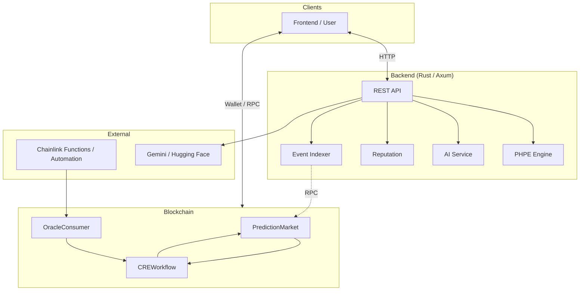

# PraesagiumChain

Decentralized prediction markets powered by **Chainlink CRE**, AI (Gemini), multi-source data (Binance, Chainlink, X, Reddit), and Solidity smart contracts.

---

## Overview

PraesagiumChain implements trustless market resolution via Chainlink: off-chain data and AI sentiment drive on-chain outcomes through the CRE (Request & Execution) workflow. The backend fuses time-series predictions (PHPE), sentiment analysis, and price feeds into a single hybrid API.



---

## Why PraesagiumChain is different

- **Calibrated uncertainty (PHPE)** — Users see not only a probability (Yes/No) but also an **uncertainty** band from a dedicated time-series + Bayesian engine, so they can gauge confidence before betting.
- **Single CRE layer for all sources** — Resolution can come from AI sentiment (Gemini), Chainlink Price Feeds, Binance, sports/weather APIs, or time-series predictions—all through one Chainlink CRE workflow.
- **Modular on-chain design** — Conditional, private, and tokenized (NFT) markets plus a reputation system are designed as extensions; the base protocol stays simple and gas-efficient.

---

## Tech stack

| Layer | Technologies |
|-------|----------------|
| **Smart contracts** | Solidity, OpenZeppelin, Chainlink (Functions, CRE) |
| **Tooling** | Hardhat, Node.js |
| **Backend** | Rust, Axum, PHPE engine, PostgreSQL (Supabase) |
| **AI / Data** | Gemini, Hugging Face; Binance, Chainlink price feeds |
| **Frontend (optional)** | See [docs/development-and-deployment.md](docs/development-and-deployment.md) (Supabase, env in `config/frontend.env.example`) |

---

## Chainlink Integration

This project follows [Chainlink Prediction Markets](https://chain.link/community/hackathon) guidelines:

- **AI-powered settlement** — Gemini / Hugging Face for sentiment; outcome (0/1) fed to CRE.
- **Event-driven resolution** — OracleConsumer → CREWorkflow → `resolveMarket`.
- **CRE Workflow** as the on-chain orchestration layer.
- **Blockchain + external API + LLM** — Backend calls Binance, Chainlink proxy, and AI services.
- **Private Prediction Markets (Confidential Compute)** — Commit-reveal bets; CRE workflow for confidential resolution. See [docs/private-prediction-markets.md](docs/private-prediction-markets.md).

| Component | Purpose |
|-----------|---------|
| [contracts/CREWorkflow.sol](contracts/CREWorkflow.sol) | CRE orchestration; receives oracle outcome, resolves market |
| [contracts/OracleConsumer.sol](contracts/OracleConsumer.sol) | Generic callback → CREWorkflow (simulation / Any API) |
| [contracts/PredictionMarketFunctionsConsumer.sol](contracts/PredictionMarketFunctionsConsumer.sol) | Chainlink Functions client; `fulfillRequest` → CREWorkflow |
| [contracts/PredictionMarket.sol](contracts/PredictionMarket.sol) | Binary markets (Yes/No), bets, payouts |
| [contracts/PrivatePredictionMarket.sol](contracts/PrivatePredictionMarket.sol) | Commit-reveal private markets (Confidential Compute) |
| [scripts/deploy/deployLocal.js](scripts/deploy/deployLocal.js) | Deploy PM, CRE, OracleConsumer (local) |
| [scripts/deploy/deployPrivateMarket.js](scripts/deploy/deployPrivateMarket.js) | Deploy PrivatePredictionMarket (local) |
| [scripts/deploy/deployWithFunctions.js](scripts/deploy/deployWithFunctions.js) | Deploy with Functions Consumer when `FUNCTIONS_ROUTER` is set |
| [scripts/simulateCRE.js](scripts/simulateCRE.js) | CRE flow simulation (Node; optional: with backend for outcome) |
| [scripts/inputs.json](scripts/inputs.json) | Example inputs for simulation (marketId, text_to_analyze, etc.) |
| [backend-rust/scripts/ai/sentiment-analysis.js](backend-rust/scripts/ai/sentiment-analysis.js) | Sentiment script for Chainlink Functions (returns 0/1) |
| [backend-rust/src/services/sources/chainlink.rs](backend-rust/src/services/sources/chainlink.rs) | Chainlink price source (e.g. ETH/USD) |
| [cre/praesagium-resolver/main.ts](cre/praesagium-resolver/main.ts) | CRE workflow: CRON → HTTP `/api/ai/sentiment` → outcome |
| [cre/praesagium-resolver-confidential/main.ts](cre/praesagium-resolver-confidential/main.ts) | CRE workflow for Private markets (Confidential Compute) |

**CRE flow simulation**

- **With Node (local):** `node scripts/simulateCRE.js`. Optional: `API_BASE_URL=http://localhost:4000` when the backend is running; the script calls `/api/ai/sentiment` to get the outcome and simulates the Report step.
- **With Chainlink CRE CLI:** `cd cre/praesagium-resolver && bun install` then `cd .. && cre workflow simulate praesagium-resolver --target staging-settings`. The workflow calls `/api/ai/sentiment` and computes outcome 0/1. See [cre/README.md](cre/README.md) and [Simulating Workflows](https://docs.chain.link/cre/guides/operations/simulating-workflows). Example inputs in `scripts/inputs.json`.

- **Private Prediction Markets (Confidential Compute):** `npm run deploy:private` deploys PrivatePredictionMarket. Simulate: `cre workflow simulate praesagium-resolver-confidential --target staging-settings`. See [docs/private-prediction-markets.md](docs/private-prediction-markets.md).

**Files that use Chainlink** — All components listed in the table above. Full list: [contracts/CREWorkflow.sol](contracts/CREWorkflow.sol), [contracts/OracleConsumer.sol](contracts/OracleConsumer.sol), [contracts/PredictionMarket.sol](contracts/PredictionMarket.sol), [contracts/PrivatePredictionMarket.sol](contracts/PrivatePredictionMarket.sol), [contracts/PredictionMarketFunctionsConsumer.sol](contracts/PredictionMarketFunctionsConsumer.sol), [cre/praesagium-resolver/main.ts](cre/praesagium-resolver/main.ts), [cre/praesagium-resolver-confidential/main.ts](cre/praesagium-resolver-confidential/main.ts), [backend-rust/scripts/ai/sentiment-analysis.js](backend-rust/scripts/ai/sentiment-analysis.js), [backend-rust/src/services/sources/chainlink.rs](backend-rust/src/services/sources/chainlink.rs).

---

## Data Sources

| Source | Role |
|--------|------|
| **Binance** | 24h price (BTCUSDT, ETHUSDT, etc.) |
| **Chainlink** | ETH/USD proxy (production Data Feed) |
| **Cryptocompare** | Crypto prices, 24h change |
| **Kraken** | Crypto prices (public API) |
| **Exchange Rate API** | Forex EUR/USD |
| **Finnhub** | Stocks/crypto (requires FINNHUB_API_KEY) |
| **NewsAPI** | News headlines (requires NEWSAPI_KEY) |
| **CoinGecko** | Prices (price-above resolution) |
| **Open-Meteo** | Weather (weather-rained resolution) |
| **API-Football** | Sports (sports-winner resolution) |
| **X / Reddit** | Text → AI sentiment (Gemini) |
| **PHPE** | Time-series prediction engine |

---

## Quick Start

**Contracts (local network)**

1. In one terminal, start the Hardhat local node (keep it running):
   ```bash
   npm run node
   ```
   or `npx hardhat node`.

2. In another terminal, compile and deploy:
   ```bash
   npm install && npx hardhat compile
   npm run deploy
   ```
   Add deploy addresses to `.env`: `PREDICTION_MARKET_ADDRESS`, `ORACLE_CONSUMER_ADDRESS`, `CRE_WORKFLOW_ADDRESS`, `RPC_URL`, `API_BASE_URL`, `PRIVATE_KEY`.

3. **E2E demo** (with backend running): `npm run demo` — create market → bet → resolve (AI) → claim. See [docs/development-and-deployment.md](docs/development-and-deployment.md) § 6.

4. Simulate the CRE flow: `node scripts/simulateCRE.js`

**Backend**

```bash
cp config/env.example .env   # fill DATABASE_URL (Supabase) and other values
npm run backend
```

Use the **Session pooler** connection string from Supabase (Dashboard → Connect → Session pooler) if you are on an IPv4-only network (e.g. WSL). See [backend-rust/README.md](backend-rust/README.md) and [docs/development-and-deployment.md](docs/development-and-deployment.md) § 1.2.

To apply the schema to Supabase from the terminal (with the project linked): `npm run db:push`.


**Frontend & Supabase** — See [docs/development-and-deployment.md](docs/development-and-deployment.md) for env vars and [docs/frontend-project.md](docs/frontend-project.md) for the **frontend project brief** (tasks, stack, and API/contract integration for your teammate).

---

## API (Backend)

| Method | Path | Purpose |
|--------|------|---------|
| POST | `/api/ai/sentiment` | Sentiment (Gemini) |
| POST | `/api/predict` | PHPE prediction from time series |
| POST | `/api/predict/hybrid` | Hybrid: series + sentiment + Binance/Chainlink |
| GET | `/api/sources` | List available data sources |
| GET | `/api/sources/fetch?source=X&...` | Fetch from source (binance, cryptocompare, kraken, exchangerate, finnhub, newsapi) |

**Example — fetch from Cryptocompare**
```bash
curl "http://localhost:4000/api/sources/fetch?source=cryptocompare&fsym=BTC&tsym=USD"
```

**Example — hybrid (sentiment + Binance)**

```bash
curl -X POST http://localhost:4000/api/predict/hybrid \
  -H "Content-Type: application/json" \
  -d '{"sentiment_text":"Bitcoin going up","binance_symbol":"BTCUSDT"}'
```

**Example — hybrid (social + Chainlink price)**

```bash
curl -X POST http://localhost:4000/api/predict/hybrid \
  -H "Content-Type: application/json" \
  -d '{"social_texts":["Bitcoin bullish from X"],"use_chainlink_price":true,"market_id":1}'
```

---

## Environment files

See [docs/architecture-and-design.md](docs/architecture-and-design.md) § 2.1 for env layout and folder structure.

---

## Repository structure

See [docs/architecture-and-design.md](docs/architecture-and-design.md) for details. Summary:

```
PraesagiumChain/
├── config/                 # Env templates
│   ├── env.example         # → root .env
│   └── frontend.env.example
├── contracts/              # Solidity source
│   ├── PredictionMarket.sol, CREWorkflow.sol, OracleConsumer.sol...
│   └── interfaces/
├── scripts/
│   ├── deploy/            # Deploy (local, Sepolia, Polygon)
│   ├── demo/              # E2E demo
│   ├── test/              # Contract tests
│   ├── verify/            # Etherscan verification
│   ├── run-backend.js     # Backend launcher
│   ├── simulateCRE.js     # CRE simulation (Node)
│   ├── resolveFromBackend.js
│   ├── syncCreAbi.js      # Sync ABI to cre/ after compile
│   └── inputs.json
├── backend-rust/          # REST API (Rust, Axum)
│   ├── phpe/              # Prediction engine
│   ├── scripts/ai/        # Chainlink Functions scripts
│   └── src/
├── cre/                   # Chainlink CRE workflow
│   ├── praesagium-resolver/   # Workflow code
│   ├── contracts/evm/src/abi/ # ABI (synced from compile)
│   └── project.yaml
├── docs/
├── supabase/              # Schema & migrations
└── package.json
```

---

## Hackathon & best practices

This project follows the [Chainlink Prediction Markets Hackathon](https://chain.link/community/hackathon) guidelines (CRE workflow, Chainlink Functions, simulation, documentation).

For a **submission-ready checklist** (contract address, testnet, Scan URL, demo video, live link), see **[docs/development-and-deployment.md](docs/development-and-deployment.md) § 6**. References:

- [HackQuest – Best practices for Web3 hackathon submissions](https://www.hackquest.io/blog/Best-Practices-for-Successful-Web3-Hackathon-Project-Submissions) — documentation, testnet deployment, Scan URL, demo video, GitHub.
- [Hackathon 101 – Survival guide (Medium)](https://medium.com/@BizthonOfficial/hackathon-101-the-ultimate-survival-guide-for-first-time-web3-developers-4f3d51fbab0d) — MVP, deploy frontend (Vercel/Netlify), clear README, demo script.
- [web3-hackathon-starter](https://github.com/envoy1084/web3-hackathon-starter) — repo structure, env setup, tech stack.

**Demo (no UI):** `npm run demo` runs create market → bet → resolve (AI) → claim. See [docs/development-and-deployment.md](docs/development-and-deployment.md) § 5.

**Before submitting:** deploy contracts on the **correct testnet** (see [docs/development-and-deployment.md](docs/development-and-deployment.md) § 3.2), add contract addresses and Scan URLs to [README](#deployed-contracts) and the submission checklist, and record a short **demo video** (2–5 min). Testnet ETH: [Sepolia faucets](https://sepoliafaucet.com) · [Polygon Amoy](https://faucet.polygon.technology).

## Deployed contracts

When you deploy to a public network (Sepolia, Polygon, etc.), add addresses and **Scan URLs** here and in [docs/development-and-deployment.md](docs/development-and-deployment.md) § 6:

| Contract | Network | Address | Explorer |
|----------|---------|---------|----------|
| PredictionMarket | — | — | [Etherscan](https://sepolia.etherscan.io/address/) / [Polygonscan](https://polygonscan.com/address/) |
| CREWorkflow | — | — | — |
| OracleConsumer | — | — | — |
| PredictionMarketFunctionsConsumer | — | — | (only if using `deployWithFunctions.js`) |

Example: `PredictionMarket | Sepolia | 0x1234... | [View](https://sepolia.etherscan.io/address/0x1234...)`.

## Documentation

| Document | Contents |
|----------|----------|
| **[docs/architecture-and-design.md](docs/architecture-and-design.md)** | Architecture, contracts, CRE workflow, PHPE engine, repo structure, intellectual property. |
| **[docs/development-and-deployment.md](docs/development-and-deployment.md)** | API, configuration, deployment, **verification (tests, E2E demo)**, CRE simulation, troubleshooting, submission checklist, contribution. |
| **[docs/security-and-operations.md](docs/security-and-operations.md)** | Security, production optimization, monitoring, CI/CD. |
| **[docs/frontend-project.md](docs/frontend-project.md)** | Frontend project brief: tasks, stack, env, API and contracts for the frontend developer. |

---

## Authors

- **Jhuomar Boskoll Quintero**
- **Querube Yuneth Ariza Ríos**

## License

[Apache-2.0](LICENSE)
