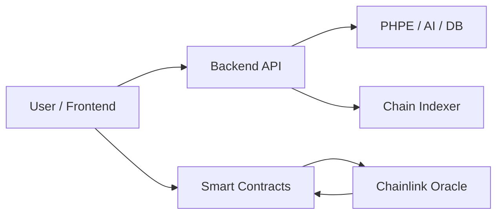
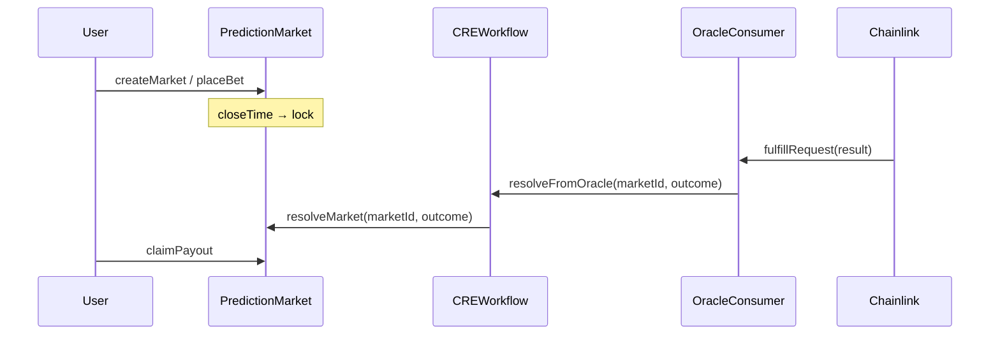
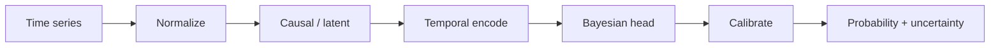
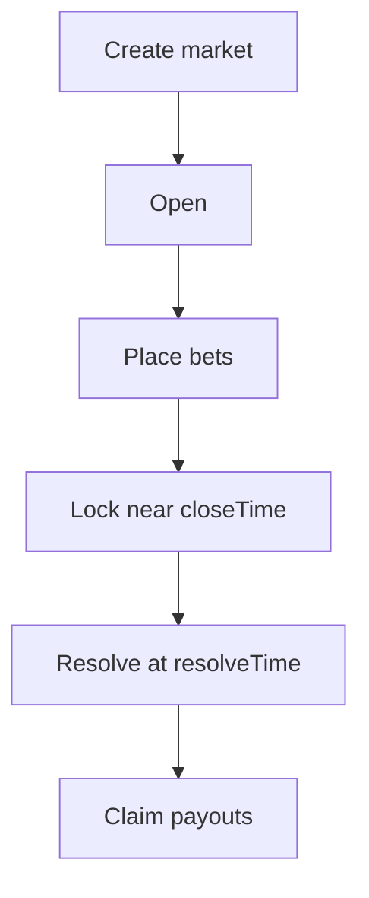

# PraesagiumChain — Architecture

This document describes the system architecture, smart contracts, Chainlink CRE workflow, PHPE engine, repository structure, and security.

---

## 1. Overview

PraesagiumChain is a **decentralized prediction market** system that uses:

- **Smart contracts (Solidity)** for on-chain market logic, bets, and payouts.
- **Chainlink CRE (Request & Execution)** for trustless resolution from off-chain data.
- **PHPE (Praesagium Hybrid Predictive Engine)** in Rust for probabilistic predictions.
- **Backend (Rust, Axum)** for REST API, PHPE integration, AI/reputation, and optional on-chain indexing.



---

## 2. Repository Structure

```text
praesagiumchain/
├── contracts/              # Solidity smart contracts
│   ├── PredictionMarket.sol
│   ├── CREWorkflow.sol
│   ├── OracleConsumer.sol
│   ├── ConditionalMarket.sol
│   ├── PrivateMarket.sol
│   ├── TokenizedMarket.sol
│   ├── ReputationSystem.sol
│   └── interfaces/
├── backend-rust/           # Rust API (Axum + SQLite)
│   ├── src/api/
│   ├── src/services/
│   ├── migrations/
│   └── Cargo.toml
├── rust-engine/             # PHPE prediction engine (library)
├── scripts/                 # Hardhat deploy & test
├── ai-integration/          # Scripts for Chainlink Functions (sentiment)
├── docs/                    # Documentation (this folder)
├── frontend/                # Frontend app (separate team)
├── hardhat.config.js
└── package.json
```

**Conventions**: Docs and comments in **English**; directories lowercase with hyphens; one main contract per file; interfaces under `contracts/interfaces/`.

---

## 3. Smart Contracts

### 3.1 Core flow



### 3.2 Contract roles

| Contract | Role |
|----------|------|
| **PredictionMarket.sol** | Binary markets: create, placeBet (Yes/No), resolveMarket, claimPayout. Only the configured resolver can resolve. |
| **CREWorkflow.sol** | Bridge: accepts resolution from the oracle only and calls `PredictionMarket.resolveMarket()`. |
| **OracleConsumer.sol** | Receives Chainlink Functions/Any API callback; decodes outcome and forwards to CREWorkflow. |
| **ConditionalMarket.sol** | If-then markets: resolution depends on other markets (condition_contract + condition_market_id + expected_outcome). |
| **PrivateMarket.sol** | Access control: only `isParticipant(marketId, account)` can participate; private details via `detailsHash` / `encryptedURI`. |
| **TokenizedMarket.sol** | ERC-721 “Praesagium Market”: one NFT per market (tokenId = marketId); creator owns NFT; tradeable on OpenSea. |
| **ReputationSystem.sol** | Tracks creator stats and reputation score; hooks `onMarketCreated` / `onMarketResolved`; authorized callers only. |

Modularity: each feature (AI, private, reputation, conditional, tokenized) can be enabled or disabled at the integration layer.

---

## 4. Chainlink CRE Workflow (Resolution)

Resolution uses Chainlink so that **off-chain data** drives on-chain market outcome in a decentralized way.

### 4.1 Step-by-step

1. **Market created** — `PredictionMarket.createMarket()` sets `closeTime` and `resolveTime`.
2. **Bets** — Users call `placeBet()`; stakes update `totalYesStake` / `totalNoStake`.
3. **Lock** — Near `closeTime`, market is locked (no more bets).
4. **Resolve** — At `resolveTime`, Chainlink Functions (or Any API) runs off-chain logic, gets result (e.g. Yes=1 / No=0).
5. **Callback** — Result is sent to `OracleConsumer.fulfillRequest(...)` (or equivalent).
6. **On-chain resolve** — OracleConsumer → CREWorkflow → `PredictionMarket.resolveMarket(marketId, outcome)`.
7. **Payouts** — Users call `claimPayout()` to receive funds.

### 4.2 Chainlink components

- **Chainlink Functions**: run off-chain code (e.g. call API, run sentiment script); return a value to the consumer contract.
- **Chainlink Automation**: trigger at `resolveTime` (e.g. run AI analysis, then submit result).
- **CCIP** (future): cross-chain sync for multi-chain markets.

Security: only the configured **resolver** can resolve; resolution is final once set.

---

## 5. PHPE Prediction Engine

**PHPE (Praesagium Hybrid Predictive Engine)** produces well-calibrated probabilities and uncertainty for binary events.

### 5.1 Outputs

- `probability` ∈ [0, 1]
- `uncertainty` ∈ [0, 1] (epistemic proxy)
- `model_version`, `model_hash` (auditability)

### 5.2 Pipeline (high level)



- **Data layer**: normalization and feature prep.
- **Causal layer**: optional DAG for domain structure (MVP).
- **Temporal encoder**: time-series embedding.
- **Bayesian head**: ensemble probability and uncertainty.
- **Calibration**: temperature scaling (and optional isotonic) for reliable probabilities.

PHPE runs **off-chain** in `rust-engine/` and is used in-process by `backend-rust/` (no CLI subprocess). The backend can store predictions in the `predictions` table and expose them via the API.

---

## 6. Data Flows

### 6.1 Market lifecycle



### 6.2 On-chain vs off-chain

| On-chain | Off-chain |
|----------|-----------|
| Market creation, bets, resolution, payouts | PHPE predictions, AI sentiment, reputation aggregation |
| Contract state and events | Backend API, SQLite, event indexer |
| Oracle callback for resolution | Chainlink Functions / Automation, Hugging Face (or similar) |

---

## 7. Security (Summary)

- **Contracts**: Permissioned resolver; resolution immutable once set.
- **PHPE**: Deterministic, versioned, hash for traceability.
- **Backend**: Rust type safety, input validation, env-based secrets (e.g. HF_API_KEY).
- **AI**: API keys in env or Chainlink secrets; treat AI output as one input to resolution.

For API, config, and feature details (AI, tokenized, private, reputation, frontend), see **[02-API-AND-GUIDES.md](./02-API-AND-GUIDES.md)**.
