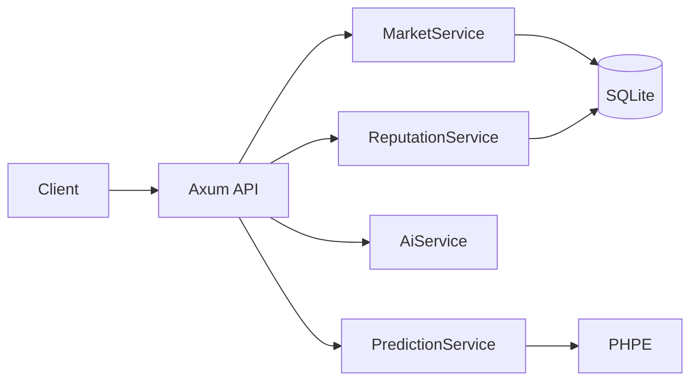

# PraesagiumChain — API Reference & Guides

This document covers the backend API, configuration, database, feature guides (AI, tokenized, private, reputation), frontend handoff, and external API references.

---

## 1. Backend Overview

The backend is a **Rust (Axum)** REST API that:

- Serves market CRUD, predictions, AI sentiment, and reputation.
- Integrates **PHPE** in-process (no CLI subprocess).
- Uses **SQLite** for markets, predictions, conditional conditions, and creator reputation.
- Can run an **event indexer** (optional) when `RPC_URL` and `PREDICTION_MARKET_ADDRESS` are set.



---

## 2. Configuration (Environment)

| Variable | Description | Default |
|----------|-------------|---------|
| `PORT` | HTTP server port | `4000` |
| `DATABASE_URL` | SQLite (or other) connection string | `sqlite:./data/markets.db` |
| `RPC_URL` | Ethereum RPC (optional, for indexer) | — |
| `PREDICTION_MARKET_ADDRESS` | PredictionMarket contract address (optional) | — |
| `START_BLOCK` | Indexer start block (optional) | — |
| `AI_PROVIDER` | `mock` or `huggingface` | `mock` |
| `HF_API_KEY` | Hugging Face API key (for `huggingface`) | — |
| `HF_MODEL` | Hugging Face model id | `cardiffnlp/twitter-roberta-base-sentiment-latest` |

Run migrations (e.g. `sqlx migrate run`) so tables exist (markets, predictions, conditional_conditions, creator_reputation).

---

## 3. API Endpoints Reference

Base URL is configurable (e.g. `http://localhost:4000`). Send `Content-Type: application/json` for POST/PATCH bodies. Errors return 4xx/5xx and may include a JSON body.

### 3.1 Health & metrics

| Method | Path | Description |
|--------|------|-------------|
| GET | `/health` | Liveness check. |
| GET | `/api/metrics` | Backend metrics (e.g. Prometheus-style). |

### 3.2 Markets

| Method | Path | Description |
|--------|------|-------------|
| GET | `/api/markets` | List markets. Query: `page`, `limit`, `status` (e.g. Open, Resolved). Returns paginated `MarketView[]`. |
| GET | `/api/markets/stats` | Aggregate stats: total_markets, open_markets, resolved_markets, total_predictions. |
| GET | `/api/markets/:id` | Single market by id. |
| POST | `/api/markets` | Create market. Body: `CreateMarketRequest`. Returns 201 + `MarketView`. |
| POST | `/api/markets/conditional` | Create conditional market. Body: `CreateConditionalMarketRequest`. Returns 201 + `MarketView`. |
| PATCH | `/api/markets/:id/status` | Update status. Body: `{ "status", "outcome" }` (outcome required if status is Resolved). |
| POST | `/api/markets/:id/prediction` | Set prediction (probability, uncertainty, model_version, model_hash). |
| GET | `/api/markets/:id/predictions` | List predictions for market. Query: `limit`. |
| POST | `/api/markets/:id/ai/predict` | Run AI sentiment on body `{ "text" }` and store as prediction for this market. |

### 3.3 AI

| Method | Path | Description |
|--------|------|-------------|
| POST | `/api/ai/sentiment` | Body: `{ "text" }`. Returns `provider`, `sentiment_score` (-1..1), `probability` (0..1). |

### 3.4 Predict (PHPE)

| Method | Path | Description |
|--------|------|-------------|
| POST | `/api/predict` | Body: `{ "time_series": TimeSeriesSample, "market_id": number | null }`. Runs PHPE; if `market_id` is set, stores prediction. Returns `{ prediction, market_id }`. |

**TimeSeriesSample**: `{ "timestamps": number[], "features": [ { "values": number[] }, ... ] }` — each feature row length must equal `timestamps.length`.

### 3.5 Reputation

| Method | Path | Description |
|--------|------|-------------|
| GET | `/api/reputation/:address` | Creator reputation. Returns `CreatorReputation`: creator_address, markets_created, markets_resolved, correct_predictions, reputation_score, updated_at. |

---

## 4. Data Shapes (TypeScript-friendly)

```ts
interface MarketView {
  id: number;
  question: string;
  close_time: number;
  resolve_time: number;
  status: string;
  outcome?: string;
  total_yes_stake: number;
  total_no_stake: number;
  creator?: string;
  market_type: string;
  metadata?: string;
  details_hash?: string;
  encrypted_uri?: string;
  latest_prediction?: PredictionView;
}

interface PredictionView {
  probability: number;
  uncertainty?: number;
  model_version?: string;
  timestamp: number;
}

interface CreateMarketRequest {
  question: string;
  close_time: number;
  resolve_time: number;
  creator?: string;
  market_type?: string;
  metadata?: string;
  details_hash?: string;
  encrypted_uri?: string;
}

interface ConditionalConditionInput {
  condition_contract: string;
  condition_market_id: number;
  expected_outcome: string;
}

interface CreateConditionalMarketRequest {
  question: string;
  close_time: number;
  resolve_time: number;
  creator?: string;
  conditions: ConditionalConditionInput[];
  metadata?: string;
}

interface CreatorReputation {
  creator_address: string;
  markets_created: number;
  markets_resolved: number;
  correct_predictions: number;
  reputation_score: number;
  updated_at: number;
}

interface PaginatedResponse<T> {
  items: T[];
  total: number;
  page: number;
  limit: number;
}

interface MarketStats {
  total_markets: number;
  open_markets: number;
  resolved_markets: number;
  total_predictions: number;
}
```

---

## 5. Feature Guides

### 5.1 AI integration

- **Backend**: `POST /api/ai/sentiment` and `POST /api/markets/:id/ai/predict`; config via `AI_PROVIDER`, `HF_API_KEY`, `HF_MODEL`.
- **Flow**: Create market → gather text (off-chain or Chainlink) → run sentiment (backend or Chainlink Function) → oracle calls `resolveMarket(marketId, outcome)`.
- **Scripts**: `ai-integration/sentiment-analysis.js` (Chainlink Functions: args → 0/1); `ai-integration/huggingface-api.js` (Node, local testing). Keep API keys in env or Chainlink secrets.

### 5.2 Tokenized markets (NFTs)

- **Contract**: `TokenizedMarket.sol` mints an ERC-721 per market (tokenId = marketId) to the creator. Same market logic (placeBet, resolve, claimPayout); NFT represents ownership and is tradeable (e.g. OpenSea).
- **Backend**: Lists markets by type; does not mint NFTs. Indexer can sync from chain.

### 5.3 Private markets

- **Contract**: `PrivateMarket.sol` (or access-controlled logic): only `isParticipant(marketId, account)` can participate. Use `detailsHash` / `encryptedURI` for private metadata.
- **Backend**: Supports `market_type: "private"`, `details_hash`, `encrypted_uri`. UI should only show full details to participants (check contract or future backend endpoint).

### 5.4 Reputation

- **On-chain**: `ReputationSystem.sol` — `onMarketCreated` / `onMarketResolved`; authorized callers only.
- **Backend**: Table `creator_reputation`; `GET /api/reputation/:address`. On market create/resolve, backend updates reputation (markets_created, markets_resolved, correct_predictions, reputation_score).

---

## 6. Frontend Handoff (Summary)

**Scope**: List/filter markets, create standard/conditional/private/tokenized/AI markets, show predictions and set them (PHPE or AI), dashboard with charts, reputation display, conditional/private/tokenized UIs.

**API**: Use the endpoints above; base URL from env (e.g. `VITE_API_BASE_URL`). CORS is enabled. Handle 4xx/5xx and optional JSON error body.

**Contracts**: Read state via RPC/ethers/viem; writes (create market, bet, resolve, claim) from user wallet. Contract roles: PredictionMarket, ConditionalMarket, PrivateMarket, TokenizedMarket, ReputationSystem — see [01-ARCHITECTURE.md](./01-ARCHITECTURE.md). Put deploy addresses and ABIs in env or repo (e.g. `contracts/artifacts`).

**Checklist**: Market list/detail + stats; create market (standard + conditional); private (market_type + details_hash/encrypted_uri); tokenized (NFT badge + OpenSea link); predictions (GET/POST) and AI sentiment (preview + store); dashboard (historical data, Chart.js/D3); reputation (`GET /api/reputation/:address`); update status (admin/oracle). Suggested stack: React/Vue/Svelte, fetch/axios, MetaMask + ethers/viem, charts via D3/Chart.js.

---

## 7. External API References

- **Chainlink Functions**: [docs.chain.link/chainlink-functions](https://docs.chain.link/chainlink-functions) — off-chain execution, return value to consumer.
- **Chainlink Automation**: [docs.chain.link/chainlink-automation](https://docs.chain.link/chainlink-automation) — scheduled tasks (e.g. resolve at resolveTime).
- **Chainlink CCIP**: [docs.chain.link/ccip](https://docs.chain.link/ccip) — cross-chain (future).
- **Hugging Face Inference**: backend uses `AI_PROVIDER=huggingface` with `HF_API_KEY` and `HF_MODEL`.
- **Data sources** (examples): FRED, Alpha Vantage, NewsAPI — use from Chainlink or backend as needed.

For system architecture and contracts, see **[01-ARCHITECTURE.md](./01-ARCHITECTURE.md)**.
