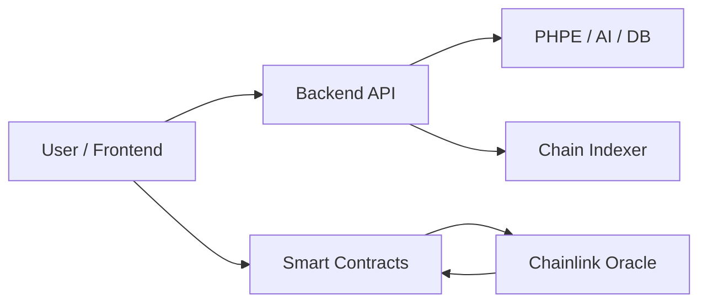
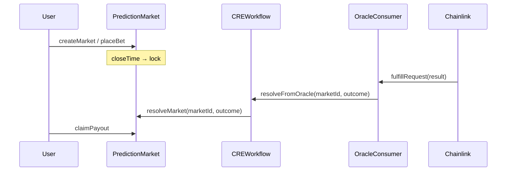
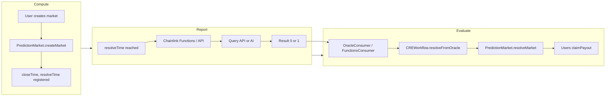
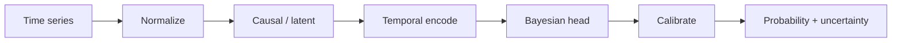
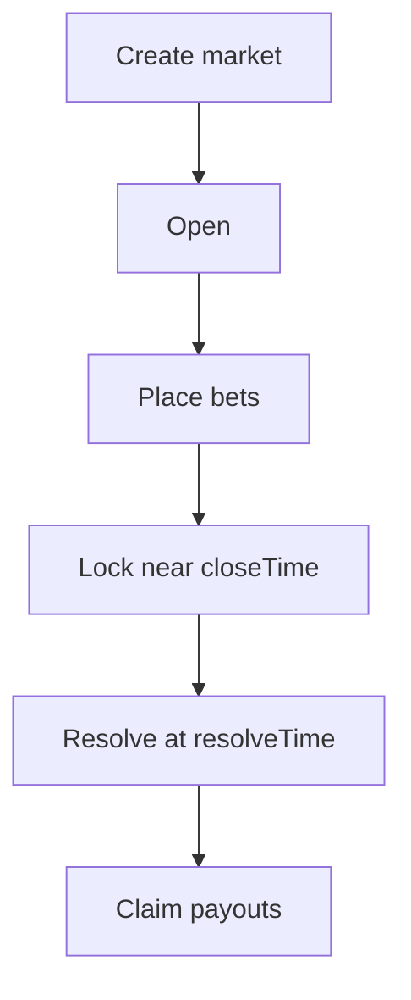

# PraesagiumChain — Architecture

This document describes the system architecture, smart contracts, Chainlink CRE workflow, PHPE prediction engine, repository layout, data flows, and security posture.

---

## 1. System Overview

PraesagiumChain is a decentralized prediction market system that combines:

- **Smart contracts (Solidity)** — On-chain market lifecycle, bets, and payouts.
- **Chainlink CRE** — Trustless resolution from off-chain data and AI.
- **PHPE (Praesagium Hybrid Predictive Engine)** — Calibrated probabilities and uncertainty in Rust.
- **Backend (Rust, Axum)** — REST API, engine integration, AI, Binance/Chainlink data sources.



---

## 2. Repository Structure

```text
praesagiumchain/
├── config/                 # Env templates, frontend setup notes
├── contracts/              # Solidity smart contracts
├── backend-rust/           # REST API, PHPE, AI
│   ├── phpe/               # Prediction engine
│   ├── scripts/ai/        # Chainlink Functions scripts
│   └── src/services/
│       ├── ai/             # Sentiment: Mock, Gemini, HuggingFace
│       ├── sources/        # Binance, Chainlink
│       └── hybrid.rs       # Fusion: engine + sentiment + price
├── scripts/                # Hardhat deploy & simulation
├── supabase/               # Postgres schema (Supabase)
├── docs/
└── README.md
```

**Conventions:** Documentation and comments in **English**; directories lowercase with hyphens; one main contract per file; interfaces under `contracts/interfaces/`. Configuration lives in `config/`; `.env` at repo root is gitignored.

---

## 3. Smart Contracts

### 3.1 Resolution Flow

Resolution is oracle-driven: Chainlink delivers an outcome (e.g. Yes=1 / No=0) to the consumer, which forwards it to CRE, which calls the market contract.



### 3.2 Contract Roles

| Contract | Role |
|----------|------|
| **PredictionMarket.sol** | Binary markets: create, placeBet (Yes/No), resolveMarket, claimPayout. Only the configured resolver can resolve. |
| **CREWorkflow.sol** | Bridge: accepts resolution from the oracle and calls `PredictionMarket.resolveMarket()`. |
| **OracleConsumer.sol** | Receives generic oracle callback (simulation or Any API); forwards to CREWorkflow. |
| **PredictionMarketFunctionsConsumer.sol** | Chainlink Functions client: implements `fulfillRequest`; decodes response to (marketId, outcome) and calls CREWorkflow. |
| **ConditionalMarket.sol** | If-then markets: resolution depends on other markets (condition_contract, condition_market_id, expected_outcome). |
| **PrivateMarket.sol** | Access control: only `isParticipant(marketId, account)` can participate; private details via `detailsHash` / `encryptedURI`. |
| **TokenizedMarket.sol** | ERC-721 “Praesagium Market”: one NFT per market (tokenId = marketId); creator owns NFT; tradeable (e.g. OpenSea). |
| **ReputationSystem.sol** | Tracks creator stats and reputation; hooks `onMarketCreated` / `onMarketResolved`; authorized callers only. |

Features (AI, private, reputation, conditional, tokenized) are modular and can be enabled or disabled at the integration layer.

---

## 4. Chainlink CRE Workflow (Compute – Report – Evaluate)

Resolution uses Chainlink so that **off-chain data** drives on-chain outcome in a decentralized way. The flow implements the **CRE (Compute-Report-Evaluate)** pattern required for prediction markets.



### 4.1 Compute – Report – Evaluate flow

| Phase | Description | Implementation in PraesagiumChain |
|-------|-------------|-----------------------------------|
| **Compute** | The user creates a market; the contract registers it and defines resolution conditions. | `PredictionMarket.createMarket(question, closeTime, resolveTime)`. The contract stores the question, `closeTime` (betting closes) and `resolveTime` (resolution time). |
| **Report** | When it is time to resolve, the system queries an external source (API, AI) using **Chainlink Functions**. | Chainlink Functions runs off-chain logic (e.g. `backend-rust/scripts/ai/sentiment-analysis.js` or a weather/sports API call). The script returns a result (0 = No, 1 = Yes). For local simulation, `scripts/simulateCRE.js` calls the backend `/api/ai/sentiment` to get the outcome. |
| **Evaluate** | Chainlink validates the data and sends it to the contract. The contract resolves the market and lets winners claim. | `OracleConsumer.oracleCallback(marketId, rawOutcome)` receives the result (signature compatible with Chainlink callback). Forwards to `CREWorkflow.resolveFromOracle(marketId, outcome)` → `PredictionMarket.resolveMarket(marketId, outcome)`. Users call `claimPayout(marketId)` to receive rewards. |

### 4.2 Steps (detail)

1. **Market created** — `PredictionMarket.createMarket()` sets `closeTime` and `resolveTime`.
2. **Bets** — Users call `placeBet()`; stakes update `totalYesStake` / `totalNoStake`.
3. **Lock** — Near `closeTime`, market is locked (no more bets).
4. **Resolve** — At `resolveTime`, Chainlink Functions (or Any API) runs off-chain logic and obtains result (e.g. Yes=1 / No=0).
5. **Callback** — Result is sent to `OracleConsumer.oracleCallback(marketId, rawOutcome)` (in a full Chainlink deployment, this would be the Functions callback, e.g. `fulfillRequest`).
6. **On-chain resolve** — OracleConsumer → CREWorkflow → `PredictionMarket.resolveMarket(marketId, outcome)`.
7. **Payouts** — Users call `claimPayout()` to receive funds.

### 4.3 Chainlink components (key tools)

- **Chainlink Functions** — To connect to external APIs. In this project: [PredictionMarketFunctionsConsumer.sol](../contracts/PredictionMarketFunctionsConsumer.sol) sends the request; the script (e.g. [sentiment-analysis.js](../backend-rust/scripts/ai/sentiment-analysis.js) or one that calls a weather/sports/price API) runs off-chain and returns 0/1; the Router calls `fulfillRequest` and the Consumer forwards to CREWorkflow.
- **Chainlink Automation** — For scheduled tasks (e.g. resolve markets after the event). The contract is already set up: when `resolveTime` is reached, a Chainlink Automation **Upkeep** can invoke (via an intermediary contract or off-chain) the resolution request (e.g. call Functions or the backend which then calls `OracleConsumer.oracleCallback`). Typical steps: (1) Register an Upkeep that runs at the desired date/time; (2) in `performUpkeep`, call the logic that obtains the outcome (API/AI) and sends the result on-chain. Documentation: [Chainlink Automation](https://docs.chain.link/chainlink-automation). The resolution itself (Evaluate) remains OracleConsumer / PredictionMarketFunctionsConsumer → CREWorkflow → PredictionMarket.
- **Chainlink VRF** — If verifiable randomness were needed (lotteries, random markets), it would be integrated as another source in the Report step; not required for event-based binary markets (weather, sports, price).

Only the configured **resolver** can resolve; resolution is final once set.

---

## 5. PHPE Prediction Engine

**PHPE (Praesagium Hybrid Predictive Engine)** produces calibrated probabilities and uncertainty for binary events.

### 5.1 Outputs

- `probability` ∈ [0, 1]
- `uncertainty` ∈ [0, 1] (epistemic proxy)
- `model_version`, `model_hash` (auditability)

### 5.2 Pipeline



- **Data layer** — Normalization and feature preparation.
- **Causal layer** — Optional DAG for domain structure (MVP).
- **Temporal encoder** — Time-series embedding.
- **Bayesian head** — Ensemble probability and uncertainty.
- **Calibration** — Temperature scaling (and optional isotonic) for reliable probabilities.

PHPE runs **off-chain** and is used in-process by the backend. Predictions can be stored in the `predictions` table and exposed via the API.

---

## 6. Data Flows

### 6.1 Market Lifecycle



### 6.2 On-Chain vs Off-Chain

| On-chain | Off-chain |
|----------|-----------|
| Market creation, bets, resolution, payouts | PHPE predictions, AI sentiment, reputation aggregation |
| Contract state and events | Backend API, SQLite, event indexer |
| Oracle callback for resolution | Chainlink Functions / Automation, Gemini / Hugging Face |

---

## 7. Security Summary

- **Contracts** — Permissioned resolver; resolution immutable once set.
- **PHPE** — Deterministic, versioned, hash for traceability.
- **Backend** — Rust type safety, input validation, env-based secrets (e.g. `HF_API_KEY`, `GEMINI_API_KEY`).
- **AI** — API keys in env or Chainlink secrets; treat AI output as one input to resolution, not sole authority.

For API details, configuration, and feature guides, see **[docs/DEVELOPMENT.md](DEVELOPMENT.md)**.
