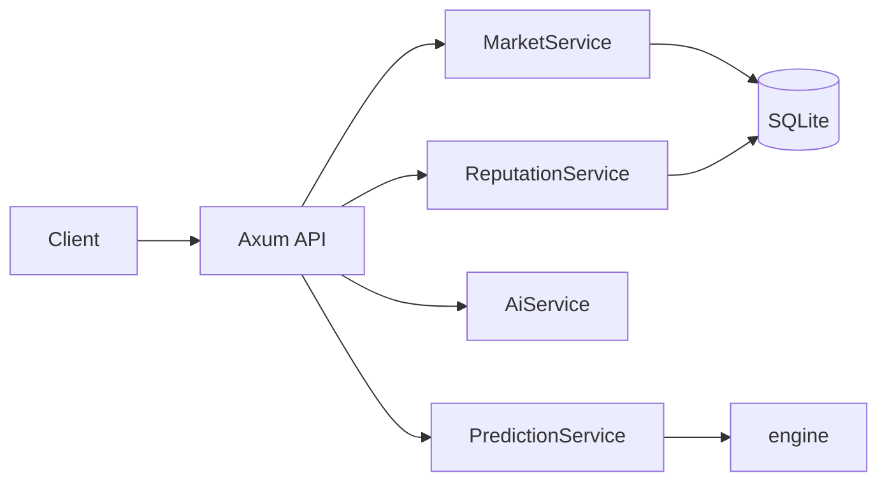

# PraesagiumChain — Development Guide

This document covers the backend API reference, configuration, setup (backend, frontend, Supabase), contributing guidelines, and feature guides (AI, tokenized, private, reputation).

---

## 1. Backend Overview

The backend is a **Rust (Axum)** REST API that:

- Serves market CRUD, predictions, AI sentiment, and reputation.
- Integrates the prediction engine in-process (no CLI subprocess).
- Uses **SQLite** for markets, predictions, conditional conditions, and creator reputation.
- Can run an **event indexer** (optional) when `RPC_URL` and `PREDICTION_MARKET_ADDRESS` are set.



---

## 2. Configuration

### 2.1 Environment Variables

Copy `config/env.example` to `.env` at the repo root.

| Variable | Description | Default |
|----------|-------------|---------|
| `PORT` | HTTP server port | `4000` |
| `DATABASE_URL` | SQLite (or other) connection string | `sqlite:./data/markets.db` |
| `RPC_URL` | Ethereum RPC (optional, for indexer) | — |
| `PREDICTION_MARKET_ADDRESS` | PredictionMarket contract address (optional) | — |
| `START_BLOCK` | Indexer start block (optional) | — |
| `AI_PROVIDER` | `mock`, `huggingface`, or `gemini` | `mock` |
| `HF_API_KEY` | Hugging Face API key (for `huggingface`) | — |
| `HF_MODEL` | Hugging Face model id | `cardiffnlp/twitter-roberta-base-sentiment-latest` |
| `GEMINI_API_KEY` | Google Gemini API key (for `gemini`) | — |
| `GEMINI_MODEL` | Gemini model id | `gemini-1.5-flash` |

Run migrations (e.g. `sqlx migrate run`) so tables exist (markets, predictions, conditional_conditions, creator_reputation).

### 2.2 Backend Build & Run

```bash
cd backend-rust
cargo build --release
cargo run --release
```

---

## 3. API Reference

Base URL is configurable (e.g. `http://localhost:4000`). Use `Content-Type: application/json` for POST/PATCH bodies. Errors return 4xx/5xx and may include a JSON body.

### 3.1 Health & Metrics

| Method | Path | Description |
|--------|------|-------------|
| GET | `/health` | Liveness check. |
| GET | `/api/metrics` | Backend metrics (e.g. Prometheus-style). |

### 3.2 Markets

| Method | Path | Description |
|--------|------|-------------|
| GET | `/api/markets` | List markets. Query: `page`, `limit`, `status`. Returns paginated `MarketView[]`. |
| GET | `/api/markets/stats` | Aggregate stats: total_markets, open_markets, resolved_markets, total_predictions. |
| GET | `/api/markets/:id` | Single market by id. |
| POST | `/api/markets` | Create market. Body: `CreateMarketRequest`. Returns 201 + `MarketView`. |
| POST | `/api/markets/conditional` | Create conditional market. Body: `CreateConditionalMarketRequest`. Returns 201 + `MarketView`. |
| PATCH | `/api/markets/:id/status` | Update status. Body: `{ "status", "outcome" }` (outcome required if status is Resolved). |
| POST | `/api/markets/:id/prediction` | Set prediction (probability, uncertainty, model_version, model_hash). |
| GET | `/api/markets/:id/predictions` | List predictions for market. Query: `limit`. |
| POST | `/api/markets/:id/ai/predict` | Run AI sentiment on body `{ "text" }` and store as prediction. |

### 3.3 Report (external sources for CRE)

These endpoints return a single **outcome** (0 or 1) for the Report step.

| Method | Path | Query | Description |
|--------|------|-------|-------------|
| GET | `/api/weather/rained` | `lat`, `lon`, `date` (YYYY-MM-DD) | Open-Meteo: outcome = 1 if precipitation_sum > 0, else 0. |
| GET | `/api/price/above` | `symbol` (e.g. BTCUSDT, bitcoin), `threshold`, optional `source=binance\|coingecko` | outcome = 1 if price ≥ threshold, else 0. |
| GET | `/api/sports/winner` | `fixture_id`, `winner_team` (with `API_FOOTBALL_KEY`); or `winner_team`, `demo_outcome=0\|1` for testing | outcome = 1 if winner_team won, else 0. |

All return `{ "outcome": 0 }` or `{ "outcome": 1 }`.

### 3.4 AI

| Method | Path | Description |
|--------|------|-------------|
| POST | `/api/ai/sentiment` | Body: `{ "text" }`. Returns `provider`, `sentiment_score` (-1..1), `probability` (0..1). |

### 3.5 Predict (Engine & Hybrid)

| Method | Path | Description |
|--------|------|-------------|
| POST | `/api/predict` | Body: `{ "time_series": TimeSeriesSample, "market_id": number \| null }`. Runs engine. Returns `{ prediction, market_id }`. |
| POST | `/api/predict/hybrid` | Hybrid: `time_series`, `sentiment_text` or `social_texts`, `binance_symbol` or `use_chainlink_price: true`. Fuses signals. |

**TimeSeriesSample:** `{ "timestamps": number[], "features": [ { "values": number[] }, ... ] }` — each feature row length must equal `timestamps.length`.

### 3.6 Reputation

| Method | Path | Description |
|--------|------|-------------|
| GET | `/api/reputation/:address` | Creator reputation. Returns `CreatorReputation`. |

---

## 4. Data Shapes (TypeScript-Friendly)

```ts
interface MarketView {
  id: number;
  question: string;
  close_time: number;
  resolve_time: number;
  status: string;
  outcome?: string;
  total_yes_stake: number;
  total_no_stake: number;
  creator?: string;
  market_type: string;
  metadata?: string;
  details_hash?: string;
  encrypted_uri?: string;
  latest_prediction?: PredictionView;
}

interface PredictionView {
  probability: number;
  uncertainty?: number;
  model_version?: string;
  timestamp: number;
}

interface CreateMarketRequest {
  question: string;
  close_time: number;
  resolve_time: number;
  creator?: string;
  market_type?: string;
  metadata?: string;
  details_hash?: string;
  encrypted_uri?: string;
}

interface CreatorReputation {
  creator_address: string;
  markets_created: number;
  markets_resolved: number;
  correct_predictions: number;
  reputation_score: number;
  updated_at: number;
}

interface PaginatedResponse<T> {
  items: T[];
  total: number;
  page: number;
  limit: number;
}
```

---

## 5. Frontend & Supabase Setup

### 5.1 Frontend Environment

Create `frontend/.env.local` (or equivalent) with:

```env
NEXT_PUBLIC_SUPABASE_URL=https://<your-project>.supabase.co
NEXT_PUBLIC_SUPABASE_PUBLISHABLE_DEFAULT_KEY=<publishable-key>
NEXT_PUBLIC_API_BASE_URL=http://localhost:4000
```

Use `NEXT_PUBLIC_API_BASE_URL` for all backend API calls. CORS is enabled on the backend.

### 5.2 Supabase

- **Tables:** Run `supabase/schema.sql` (or the project’s migration file) in Supabase Dashboard → SQL Editor.
- **Connection:** URL and connection string are in Dashboard → Project Settings → Database.
- **Frontend:** Use `@supabase/supabase-js` with the publishable key for Auth and Realtime; backend uses SQLite by default unless `DATABASE_URL` is set to the Supabase Postgres connection string.

### 5.3 Frontend Handoff Summary

- **Scope:** List/filter markets, create standard/conditional/private/tokenized/AI markets, show and set predictions (engine or AI), dashboard with charts, reputation display.
- **Contracts:** Read state via RPC/ethers/viem; writes (create market, bet, resolve, claim) from user wallet. Deploy addresses and ABIs in env or `contracts/artifacts`. See [ARCHITECTURE.md](ARCHITECTURE.md) for contract roles.

---

## 6. Feature Guides

### 6.1 AI Integration

- **Backend:** `POST /api/ai/sentiment` and `POST /api/markets/:id/ai/predict`; config via `AI_PROVIDER`, `HF_API_KEY`, `HF_MODEL`, `GEMINI_API_KEY`, `GEMINI_MODEL`.
- **Flow:** Create market → gather text (off-chain or Chainlink) → run sentiment (backend or Chainlink Function) → oracle calls `resolveMarket(marketId, outcome)`.
- **Chainlink:** Deploy a consumer that runs sentiment (e.g. script in `backend-rust/scripts/ai/`); script returns 0 or 1; OracleConsumer or CRE receives the result and resolves the market. Keep API keys in env or Chainlink secrets.

### 6.2 Tokenized Markets (NFTs)

- **Contract:** `TokenizedMarket.sol` mints an ERC-721 per market (tokenId = marketId) to the creator. Same market logic (placeBet, resolve, claimPayout); NFT represents ownership and is tradeable (e.g. OpenSea).
- **Backend:** Lists markets by type; does not mint NFTs. Indexer can sync from chain.

### 6.3 Private Markets

- **Contract:** Only `isParticipant(marketId, account)` can participate. Use `detailsHash` / `encryptedURI` for private metadata.
- **Backend:** Supports `market_type: "private"`, `details_hash`, `encrypted_uri`. UI should show full details only to participants.

### 6.4 Reputation

- **On-chain:** `ReputationSystem.sol` — `onMarketCreated` / `onMarketResolved`; authorized callers only.
- **Backend:** Table `creator_reputation`; `GET /api/reputation/:address`. On market create/resolve, backend updates reputation fields.

---

## 7. Contributing

### 7.1 Setup

1. Clone the repo; run `npm install` and `cd backend-rust && cargo build`.
2. Copy `config/env.example` to `.env` and fill values.
3. Run `npx hardhat compile` and `cargo run` in `backend-rust` as needed.

### 7.2 Code Style

- **Solidity:** OpenZeppelin conventions; one contract per file.
- **Rust:** `cargo fmt`, `cargo clippy`.
- **Docs:** English, Markdown.

### 7.3 Pull Requests

- Branch from `main`; keep changes focused; ensure tests pass.
- Never commit `.env`; use `config/env.example` as reference.

---

## 8. External data sources (Report)

The CRE **Report** flow obtains the market result from off-chain sources:

| Source | Use | Where |
|--------|-----|--------|
| **Backend `/api/ai/sentiment`** | Sentiment on text (Gemini/Hugging Face); returns probability → outcome 0/1. | `scripts/simulateCRE.js`; Chainlink Functions can call a similar API. |
| **Backend `/api/predict/hybrid`** | Combines time series, Binance/Chainlink price and sentiment for an outcome. | Hybrid integration for price/sentiment markets. |
| **Script `sentiment-analysis.js`** | Simple keyword-based sentiment for Chainlink Functions; returns 0 or 1. | `backend-rust/scripts/ai/sentiment-analysis.js`. |
| **External APIs (e.g. weather, sports)** | For markets like "Will it rain in X?" or "Will team Y win?", the source would be a specific API called from Chainlink Functions. | To be implemented in the Functions script or in the backend exposed to Chainlink. |

In production, Chainlink Functions runs the script or calls the API, validates the response and sends it to the contract (Evaluate).

---

## 9. External References

- [Chainlink Functions](https://docs.chain.link/chainlink-functions) — Off-chain execution, return value to consumer.
- [Chainlink Automation](https://docs.chain.link/chainlink-automation) — Scheduled tasks (e.g. resolve at resolveTime).
- [Chainlink CRE – Simulating Workflows](https://docs.chain.link/cre/guides/operations/simulating-workflows) — CRE CLI simulation.
- [Chainlink CCIP](https://docs.chain.link/ccip) — Cross-chain (future).
- [Supabase Docs](https://supabase.com/docs) — Auth, Realtime, Database.
- Hugging Face Inference and Google Gemini are used via backend env vars; see Configuration above.

For system architecture and contracts, see **[docs/ARCHITECTURE.md](ARCHITECTURE.md)**.
