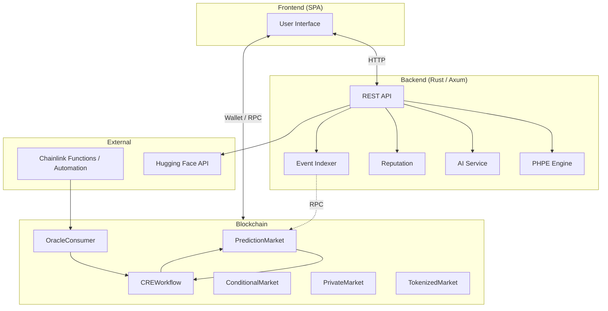

# PraesagiumChain Documentation

Technical documentation for the decentralized prediction market system. All content is in **English**.

---

## Documentation Index (3 files)

| File | Contents |
|------|----------|
| **[01-ARCHITECTURE.md](./01-ARCHITECTURE.md)** | System architecture, smart contracts, CRE workflow, PHPE engine, repository structure, data flows, security. |
| **[02-API-AND-GUIDES.md](./02-API-AND-GUIDES.md)** | Backend API reference, configuration, database, AI/tokenized/private/reputation features, frontend handoff, external APIs. |
| **README.md** (this file) | Entry point, high-level diagram, quick start. |

---

## High-Level Architecture

---

## Quick Start

1. **Contracts**: From repo root, run `npm install` and `npx hardhat compile`. Deploy with `npx hardhat run scripts/deploy/... --network <name>`.
2. **Backend**: In `backend-rust/`, set `.env` (e.g. `DATABASE_URL`, optional `RPC_URL`, `PREDICTION_MARKET_ADDRESS`, `AI_PROVIDER`). Run `cargo run` and `sqlx migrate run` if needed.
3. **Frontend**: Point the app at the backend base URL (e.g. `VITE_API_BASE_URL`). Use the API and contract ABIs as described in [02-API-AND-GUIDES.md](./02-API-AND-GUIDES.md).

For full architecture and contract roles, see [01-ARCHITECTURE.md](./01-ARCHITECTURE.md). For all API endpoints, data shapes, and feature guides, see [02-API-AND-GUIDES.md](./02-API-AND-GUIDES.md).
