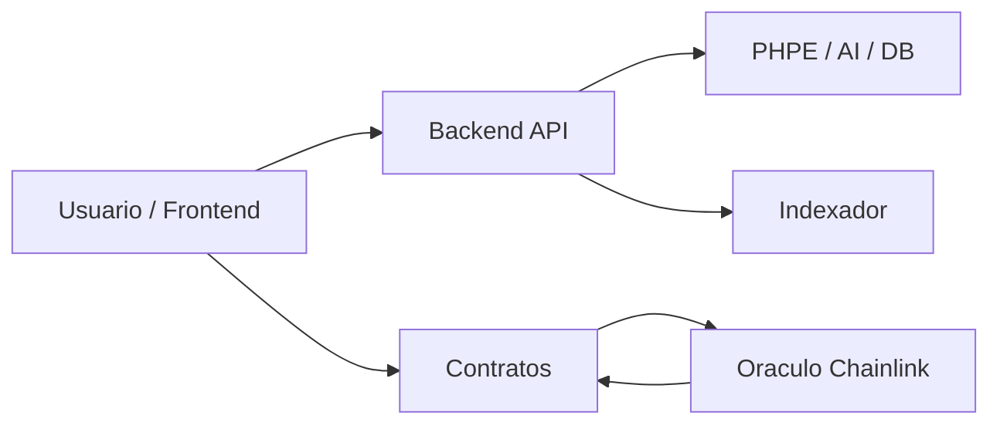
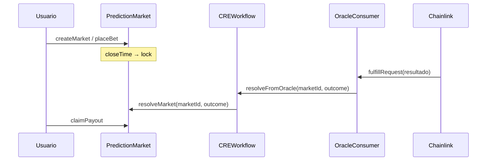
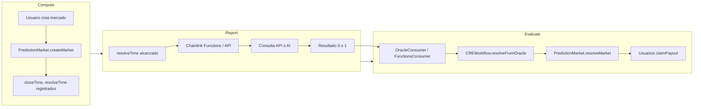
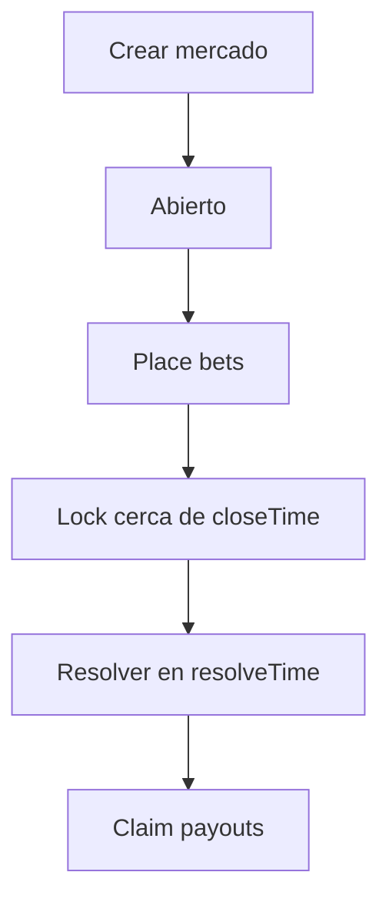

# PraesagiumChain — Arquitectura y Diseño

Documento unificado de arquitectura del sistema, contratos inteligentes, flujos CRE, motor PHPE, estructura del repositorio, propiedad intelectual y convenciones.

---

## 1. Visión general del sistema

PraesagiumChain es un sistema descentralizado de mercados de predicción que combina:

- **Contratos inteligentes (Solidity)** — Ciclo de vida de mercados, apuestas y pagos on-chain.
- **Chainlink CRE** — Resolución sin confianza desde datos off-chain y AI.
- **PHPE (Praesagium Hybrid Predictive Engine)** — Probabilidades calibradas e incertidumbre en Rust.
- **Backend (Rust, Axum)** — API REST, integración del motor, AI, fuentes Binance/Chainlink; **PostgreSQL (Supabase)** para persistencia.



---

## 2. Estructura del repositorio

```
PraesagiumChain/
├── .github/workflows/    # CI (tests contratos, backend)
├── config/               # Plantillas env (root, frontend)
├── contracts/            # Solidity (PredictionMarket, CREWorkflow, etc.)
├── backend-rust/         # API REST (Rust, Axum), motor PHPE
│   ├── phpe/             # Motor de predicción
│   ├── scripts/ai/       # Scripts Chainlink Functions
│   └── src/services/    # AI, fuentes, hybrid
├── cre/                  # Workflow CRE Chainlink
├── scripts/              # Deploy, demo, test, utilidades CRE
├── supabase/             # Esquema DB y migraciones
├── .env                  # Env principal (gitignored)
└── README.md
```

| Directorio | Propósito |
|-----------|-----------|
| **contracts/** | Código Solidity. Hardhat compila en `artifacts/`. |
| **cre/** | Proyecto CRE: `project.yaml`, workflow `praesagium-resolver/`, ABIs. |
| **scripts/** | `deploy/`, `demo/`, `test/`, `verify/`, `simulateCRE.js`, `resolveFromBackend.js`. |
| **config/** | `env.example` → root `.env`, `frontend.env.example`. |

**Convenciones:** Documentación y comentarios en inglés; directorios en minúsculas con guiones; un contrato principal por archivo. Configuración en `config/`; `.env` en root está en `.gitignore`.

### 2.1 Archivos de entorno

| Ubicación | Propósito | Usado por |
|-----------|-----------|-----------|
| **config/env.example** | Plantilla principal → copiar a **root .env** | Backend, Hardhat, deploy, demo |
| **root .env** | Env principal (gitignored) | `npm run backend`, `deploy`, `demo` |
| **cre/.env.example** | Solo CRE → copiar a **cre/.env** | Simulación workflow CRE |
| **cre/.env** | Clave privada CRE (gitignored) | `cre workflow simulate` |
| **config/frontend.env.example** | Plantilla frontend | Next.js (si se usa) |

---

## 3. Contratos inteligentes

### 3.1 Flujo de resolución

La resolución es impulsada por el oráculo: Chainlink entrega un resultado (Yes=1 / No=0) al consumer, que lo reenvía a CRE, que llama al contrato del mercado.



### 3.2 Roles de contratos

| Contrato | Rol |
|----------|-----|
| **PredictionMarket.sol** | Mercados binarios: crear, placeBet (Yes/No), resolveMarket, claimPayout. Solo el resolver configurado puede resolver. |
| **CREWorkflow.sol** | Puente: recibe resolución del oráculo y llama `PredictionMarket.resolveMarket()`. |
| **OracleConsumer.sol** | Recibe callback del oráculo; reenvía a CREWorkflow. `oracleCallback` restringido a `authorizedCallback`. |
| **PredictionMarketFunctionsConsumer.sol** | Cliente Chainlink Functions: `fulfillRequest`; decodifica a (marketId, outcome) y llama CREWorkflow. |
| **ReputationSystem.sol** | Estadísticas de creadores; hooks `onMarketCreated` / `onMarketResolved`; solo callers autorizados. |

---

## 4. Workflow Chainlink CRE (Compute – Report – Evaluate)



| Fase | Descripción |
|------|-------------|
| **Compute** | El usuario crea el mercado; el contrato registra closeTime y resolveTime. |
| **Report** | Chainlink Functions consulta API/AI y devuelve 0 o 1. |
| **Evaluate** | El resultado se envía al contrato; se resuelve el mercado y se permiten claims. |

---

## 5. Motor PHPE (Praesagium Hybrid Predictive Engine)

### 5.1 Salidas

- `probability` ∈ [0, 1]
- `uncertainty` ∈ [0, 1] (proxy epistémico)
- `model_version`, `model_hash` (auditabilidad)

### 5.2 Pipeline


- **Capa de datos** — Normalización y preparación de features.
- **Capa causal** — DAG opcional para estructura de dominio.
- **Encoder temporal** — Embedding de series temporales.
- **Cabeza bayesiana** — Ensemble de probabilidad e incertidumbre.
- **Calibración** — Temperature scaling para probabilidades fiables.

PHPE corre **off-chain** y se usa en proceso por el backend.

### 5.3 Propiedad intelectual y patentes

El PHPE combina técnicas propias:

- **Fusión híbrida** — Sentiment (Gemini/HuggingFace), precios (Binance, Chainlink) y salida PHPE en una probabilidad calibrada.
- **Incertidumbre calibrada** — Estimación epistémica junto a la probabilidad puntual.
- **Pipeline modular** — Cada etapa es testeable y reemplazable.
- **Frontera on-chain / off-chain** — Resolución vía Chainlink CRE; PHPE off-chain alimenta la API.

**Consideraciones de patente:** La combinación de técnicas en contexto de mercados de predicción puede ser patentable. Consultar abogado de patentes. Mantener documentación de diseño, métricas y comparaciones con métodos base.

---

## 6. Flujos de datos

### 6.1 Ciclo de vida del mercado



### 6.2 On-chain vs off-chain

| On-chain | Off-chain |
|----------|-----------|
| Creación, apuestas, resolución, pagos | Predicciones PHPE, sentiment AI, agregación reputación |
| Estado y eventos del contrato | API backend, PostgreSQL, indexador de eventos |
| Callback oráculo para resolución | Chainlink Functions / Automation, Gemini / Hugging Face |

---

## 7. Resumen de seguridad

- **Contratos** — Resolver con permisos; resolución inmutable. `OracleConsumer.oracleCallback` restringido a `authorizedCallback`.
- **PHPE** — Determinista, versionado, hash para trazabilidad.
- **Backend** — Tipado Rust, validación de inputs, secrets en env.
- **AI** — Claves en env; tratar la salida de AI como un input, no autoridad única.

Para API, configuración y despliegue, ver [development-and-deployment.md](development-and-deployment.md).
