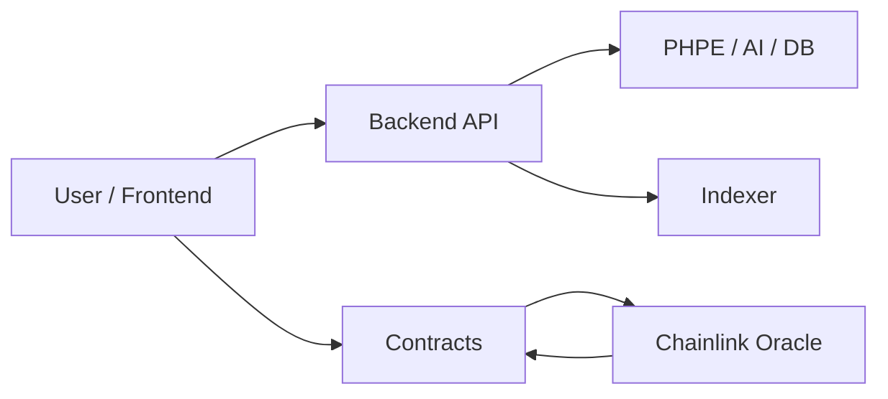
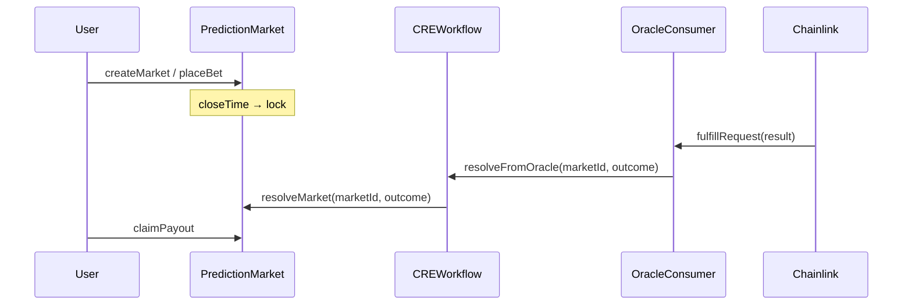
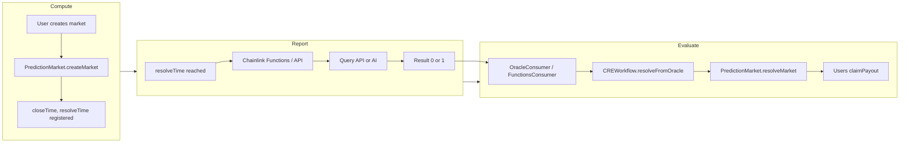
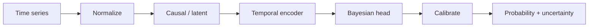
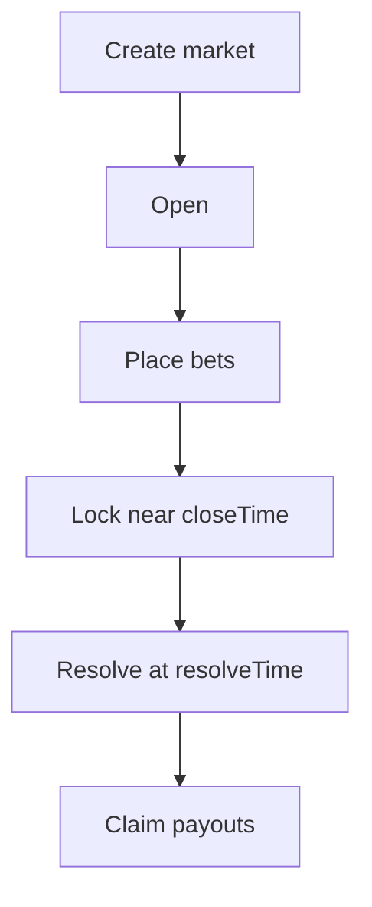

# PraesagiumChain — Architecture and Design

Unified document for system architecture, smart contracts, CRE flows, PHPE engine, repository structure, intellectual property, and conventions.

---

## 1. System Overview

PraesagiumChain is a decentralized prediction market system that combines:

- **Smart contracts (Solidity)** — Market lifecycle, bets, and payouts on-chain.
- **Chainlink CRE** — Trustless resolution from off-chain data and AI.
- **PHPE (Praesagium Hybrid Predictive Engine)** — Calibrated probabilities and uncertainty in Rust.
- **Backend (Rust, Axum)** — REST API, engine integration, AI, Binance/Chainlink sources; **PostgreSQL (Supabase)** for persistence.



---

## 2. Repository Structure

```
PraesagiumChain/
├── .github/workflows/    # CI (contract tests, backend)
├── config/               # Env templates (root, frontend)
├── contracts/            # Solidity (PredictionMarket, CREWorkflow, etc.)
├── backend-rust/         # REST API (Rust, Axum), PHPE engine
│   ├── phpe/             # Prediction engine
│   ├── scripts/ai/       # Chainlink Functions scripts
│   └── src/services/    # AI, sources, hybrid
├── cre/                  # Chainlink CRE workflow
├── scripts/              # Deploy, demo, test, CRE utilities
├── supabase/             # DB schema and migrations
├── .env                  # Main env (gitignored)
└── README.md
```

| Directory | Purpose |
|-----------|---------|
| **contracts/** | Solidity source. Hardhat compiles to `artifacts/`. |
| **cre/** | CRE project: `project.yaml`, workflow `praesagium-resolver/`, ABIs. |
| **scripts/** | `deploy/`, `demo/`, `test/`, `verify/`, `simulateCRE.js`, `resolveFromBackend.js`. |
| **config/** | `env.example` → root `.env`, `frontend.env.example`. |

**Conventions:** Documentation and comments in English; lowercase directories with hyphens; one main contract per file. Configuration in `config/`; root `.env` is in `.gitignore`.

### 2.1 Environment variables (for E2E demo)

| Variable | Purpose |
|----------|---------|
| `PREDICTION_MARKET_ADDRESS`, `ORACLE_CONSUMER_ADDRESS` | Addresses after `npm run deploy` |
| `RPC_URL` | `http://127.0.0.1:8545` (Hardhat local) |
| `API_BASE_URL` | `http://localhost:4000` (backend) |
| `PRIVATE_KEY` | Deployer key (Hardhat default or wallet) |
| `DATABASE_URL` | Supabase (backend) |

For full list, see [development-and-deployment.md](development-and-deployment.md) § 1.2 and § 6.1.

### 2.2 Env file locations

| Location | Purpose | Used by |
|----------|---------|---------|
| **config/env.example** | Main template → copy to **root .env** | Backend, Hardhat, deploy, demo |
| **root .env** | Main env (gitignored) | `npm run backend`, `deploy`, `demo` |
| **cre/.env.example** | CRE only → copy to **cre/.env** | CRE workflow simulation |
| **cre/.env** | CRE private key (gitignored) | `cre workflow simulate` |
| **config/frontend.env.example** | Frontend template | Next.js (if used) |

---

## 3. Smart Contracts

### 3.1 Resolution Flow

Resolution is oracle-driven: Chainlink delivers an outcome (Yes=1 / No=0) to the consumer, which forwards it to CRE, which calls the market contract.



### 3.2 Contract Roles

| Contract | Role |
|----------|------|
| **PredictionMarket.sol** | Binary markets: create, placeBet (Yes/No), resolveMarket, claimPayout. Only the configured resolver can resolve. |
| **CREWorkflow.sol** | Bridge: receives resolution from oracle and calls `PredictionMarket.resolveMarket()`. |
| **OracleConsumer.sol** | Receives oracle callback; forwards to CREWorkflow. `oracleCallback` restricted to `authorizedCallback`. |
| **PredictionMarketFunctionsConsumer.sol** | Chainlink Functions client: `fulfillRequest`; decodes to (marketId, outcome) and calls CREWorkflow. |
| **ReputationSystem.sol** | Creator stats; hooks `onMarketCreated` / `onMarketResolved`; authorized callers only. |

---

## 4. Workflow Chainlink CRE (Compute – Report – Evaluate)



| Phase | Description |
|-------|-------------|
| **Compute** | User creates market; contract registers closeTime and resolveTime. |
| **Report** | Chainlink Functions queries API/AI and returns 0 or 1. |
| **Evaluate** | Result is sent to contract; market is resolved and claims are allowed. |

---

## 5. PHPE Engine (Praesagium Hybrid Predictive Engine)

### 5.1 Outputs

- `probability` ∈ [0, 1]
- `uncertainty` ∈ [0, 1] (epistemic proxy)
- `model_version`, `model_hash` (auditability)

### 5.2 Pipeline



- **Data layer** — Normalization and feature preparation.
- **Causal layer** — Optional DAG for domain structure.
- **Temporal encoder** — Time-series embedding.
- **Bayesian head** — Ensemble for probability and uncertainty.
- **Calibration** — Temperature scaling for reliable probabilities.

PHPE runs **off-chain** and is used in-process by the backend.

### 5.3 Intellectual Property and Patents

PHPE combines proprietary techniques:

- **Hybrid fusion** — Sentiment (Gemini/HuggingFace), prices (Binance, Chainlink), and PHPE output into a single calibrated probability.
- **Calibrated uncertainty** — Epistemic estimation alongside point probability.
- **Modular pipeline** — Each stage is testable and replaceable.
- **On-chain / off-chain boundary** — Resolution via Chainlink CRE; PHPE off-chain feeds the API.

**Patent considerations:** The combination of techniques in a prediction-market context may be patentable. Consult a patent attorney. Maintain design documentation, metrics, and comparisons with baseline methods.

---

## 6. Data Flows

### 6.1 Market Lifecycle



### 6.2 On-chain vs Off-chain

| On-chain | Off-chain |
|----------|-----------|
| Creation, bets, resolution, payouts | PHPE predictions, AI sentiment, reputation aggregation |
| Contract state and events | Backend API, PostgreSQL, event indexer |
| Oracle callback for resolution | Chainlink Functions / Automation, Gemini / Hugging Face |

---

## 7. Security Summary

- **Contracts** — Permissioned resolver; resolution immutable. `OracleConsumer.oracleCallback` restricted to `authorizedCallback`.
- **PHPE** — Deterministic, versioned, hash for traceability.
- **Backend** — Rust type safety, input validation, secrets in env.
- **AI** — Keys in env; treat AI output as one input, not sole authority.

For API, configuration, and deployment, see [development-and-deployment.md](development-and-deployment.md).
