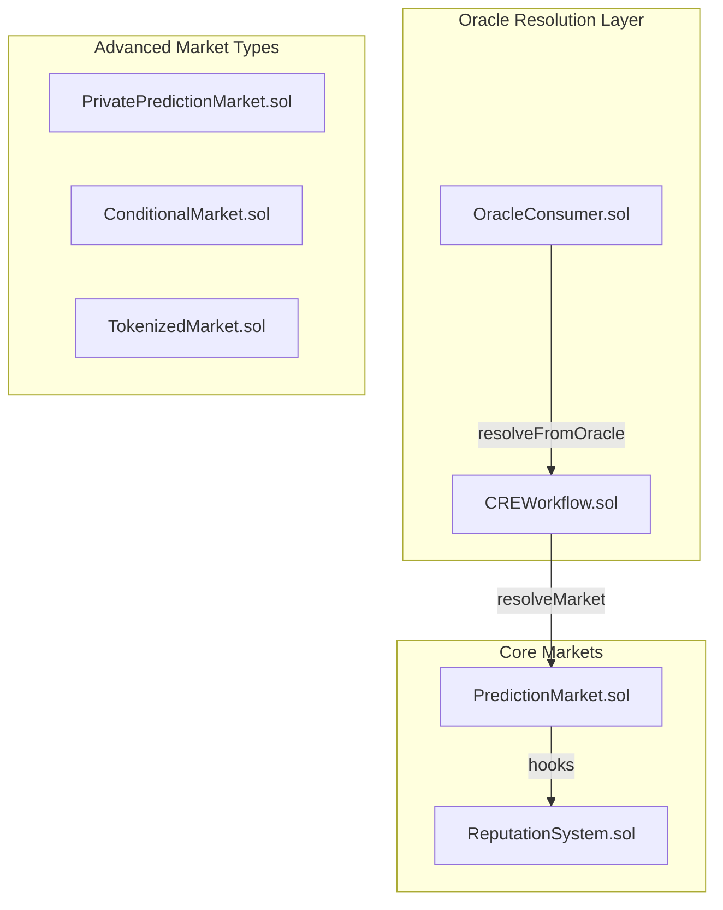

# Architecture — Contracts, Database, PHPE, and Frontend

This document provides an overview of the PraesagiumChain architecture: smart contracts, database schema, PHPE prediction engine, and frontend structure. For full implementation details, see the source files referenced below.

---

## Table of Contents

1. [Smart Contracts](#1-smart-contracts)
2. [Database Schema](#2-database-schema)
3. [On-Chain / Off-Chain Sync](#3-on-chain--off-chain-sync)
4. [PHPE and Hybrid Prediction](#4-phpe-and-hybrid-prediction)
5. [Frontend](#5-frontend)

---

## 1. Smart Contracts

**Location:** [`contracts/`](../contracts/)

### Contract Map

### Core: PredictionMarket.sol

- **createMarket(question, closeTime, resolveTime)** — Creates binary market; emits `MarketCreated`
- **placeBet(marketId, outcome)** — Places ETH bet on Yes(1) or No(2)
- **resolveMarket(marketId, outcome)** — Resolver only; requires `block.timestamp >= resolveTime`
- **claimPayout(marketId)** — Winners claim proportional share of pool
- **getMarket(marketId)** / **getUserStake(marketId, user)** — View functions

Market lifecycle: **Open** → **Locked** (closeTime) → **Resolved** (resolver) → **claimPayout**

### Oracle: OracleConsumer + CREWorkflow

- **OracleConsumer** receives `oracleCallback(marketId, rawOutcome)` from Chainlink CRE
- **CREWorkflow** implements `resolveFromOracle` → calls `PredictionMarket.resolveMarket`
- Only `authorizedCallback` can call `oracleCallback`; set to CRE executor or Functions Router

### Other Contracts

- **PrivatePredictionMarket** — Commit-reveal bets (TEE/Confidential Compute)
- **ConditionalMarket** — AND logic over other markets
- **TokenizedMarket** — ERC-721; mint NFT per market
- **ReputationSystem** — Tracks creator stats (created, resolved, score)

---

## 2. Database Schema

**Location:** [`backend-rust/migrations_pg/`](../backend-rust/migrations_pg/)

Migrations: `001_initial.sql`, `007_resolution_config.sql`, `008_private_market_access_keys.sql`

### Tables

| Table | Purpose |
|-------|---------|
| `markets` | Market metadata; `on_chain_market_id` syncs with contract |
| `predictions` | PHPE probability history per market |
| `conditional_conditions` | Conditions for conditional markets |
| `creator_reputation` | Off-chain mirror of ReputationSystem |
| `market_resolutions` | Resolution config (feed, threshold) |
| `private_market_access_keys` | Access keys for private markets |

The **EventIndexer** keeps the database in sync with on-chain events (`MarketCreated`, `MarketResolved`, etc.).

---

## 3. On-Chain / Off-Chain Sync

**EventIndexer:** [`backend-rust/src/services/indexer.rs`](../backend-rust/src/services/indexer.rs)

- Polls RPC for `MarketCreated`, `MarketResolved`, `BetPlaced`
- Inserts/updates `markets`, `creator_reputation`
- Requires `RPC_URL` and `PREDICTION_MARKET_ADDRESS` in `.env`

**Source of truth:** The blockchain. The database is a read-optimized cache.

---

## 4. PHPE and Hybrid Prediction

**PHPE (Praesagium Hybrid Predictive Engine):** [`backend-rust/phpe/`](../backend-rust/phpe/)

Pipeline: **Normalize** → **Causal infer** → **Temporal encode** → **Bayesian predict** → **Calibrate**

Output: `probability` ∈ [0, 1], `uncertainty` ∈ [0, 1] (epistemic band)

**Hybrid predictor:** [`backend-rust/src/services/hybrid.rs`](../backend-rust/src/services/hybrid.rs)

Fuses three signals:
- PHPE time-series (35%)
- AI sentiment — Gemini / Hugging Face (40%)
- Live price — Binance / Chainlink (25%)

Formula: weighted average with graceful degradation if a source fails.

**API:** `POST /api/predict` (PHPE only), `POST /api/predict/hybrid` (fused)

---

## 5. Frontend

**Location:** [`frontend/`](../frontend/)

### Stack

| Layer | Technology |
|-------|------------|
| Framework | Next.js 14 (App Router) |
| Language | TypeScript (strict) |
| Web3 | wagmi v2 + viem |
| Styling | Tailwind CSS |
| Components | Radix UI + shadcn/ui |
| State | TanStack React Query |
| Charts | lightweight-charts v5 (TradingView) |

### Key Pages

| Route | Purpose |
|-------|---------|
| `/` | Dashboard; market list, stats, filters |
| `/markets/[id]` | Market detail; bet form, predictions, chart |
| `/markets/create` | Create market (public/private) |
| `/markets/private` | Commit-reveal private markets |
| `/positions` | User positions; claim payouts |
| `/signals` | PHPE / data sources dashboard |
| `/about` | How it works |

### Environment

Single `.env` at repo root. Next.js loads via `loadEnvConfig` in `next.config.js`. Required: `NEXT_PUBLIC_CHAIN_ID`, `NEXT_PUBLIC_RPC_URL`, `NEXT_PUBLIC_PREDICTION_MARKET_ADDRESS`.

### Contract Integration

- ABIs in `frontend/lib/abis/`
- Wagmi hooks for read/write
- React Query for API cache

---

## Source Files Reference

- Contracts: [`contracts/`](../contracts/)
- Backend: [`backend-rust/src/`](../backend-rust/src/)
- PHPE: [`backend-rust/phpe/`](../backend-rust/phpe/)
- Frontend: [`frontend/`](../frontend/)
