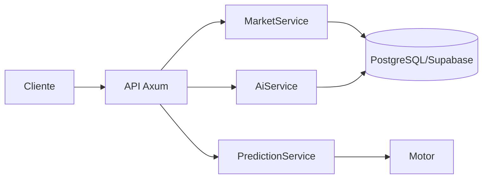

# PraesagiumChain — Desarrollo y Despliegue

Guía unificada de configuración, API, despliegue, simulación CRE, demo, checklist de submission y contribución.

---

## 1. Backend

### 1.1 Descripción

El backend es una API REST en **Rust (Axum)** que:

- Sirve CRUD de mercados, predicciones, sentiment AI y reputación.
- Integra el motor PHPE en proceso (sin subproceso CLI).
- Usa **PostgreSQL (Supabase)** para mercados, predicciones y reputación.
- Ejecuta un **indexador de eventos** (opcional) cuando están configurados `RPC_URL` y `PREDICTION_MARKET_ADDRESS`.



### 1.2 Variables de entorno

Copiar `config/env.example` a `.env` en la raíz. Para simulación CRE, copiar `cre/.env.example` a `cre/.env`.

| Variable | Descripción | Default |
|----------|-------------|---------|
| `PORT` | Puerto HTTP | `4000` |
| `DATABASE_URL` | Conexión PostgreSQL (Supabase) | — |
| `RPC_URL` | RPC Ethereum (opcional, para indexador) | — |
| `PREDICTION_MARKET_ADDRESS` | Dirección contrato (opcional) | — |
| `START_BLOCK` | Bloque inicial indexador | — |
| `CORS_ORIGINS` | Orígenes permitidos (producción) | — |
| `AI_PROVIDER` | `mock`, `huggingface`, `gemini` | `mock` |
| `HF_API_KEY`, `GEMINI_API_KEY` | Claves API AI | — |
| `GEMINI_MODEL`, `HF_MODEL` | Modelos | `gemini-1.5-flash` / `cardiffnlp/...` |

**Supabase:** Preferir el URI del **Session pooler** (Dashboard → Connect). En redes IPv4-only, el directo puede fallar. Codificar `#` en la contraseña como `%23`.

### 1.3 Build y ejecución

```bash
cd backend-rust
cargo build --release
cargo run --release
# o desde root: npm run backend
```

---

## 2. Referencia de API

Base URL configurable (ej. `http://localhost:4000`). `Content-Type: application/json` en POST/PATCH.

### 2.1 Health y métricas

| Método | Ruta | Descripción |
|--------|------|-------------|
| GET | `/health` | Liveness |
| GET | `/api/metrics` | Métricas Prometheus-style |

### 2.2 Mercados

| Método | Ruta | Descripción |
|--------|------|-------------|
| GET | `/api/markets` | Listar mercados. Query: `page`, `limit`, `status`. |
| GET | `/api/markets/:id` | Mercado por id |
| POST | `/api/markets` | Crear mercado |
| PATCH | `/api/markets/:id/status` | Actualizar status |
| POST | `/api/markets/:id/ai/predict` | Predicción AI (body: `{ "text" }`) |

### 2.3 Report (fuentes externas CRE)

Devuelven outcome 0 o 1:

| Método | Ruta | Query | Descripción |
|--------|------|-------|-------------|
| GET | `/api/weather/rained` | `lat`, `lon`, `date` | Precipitación Open-Meteo |
| GET | `/api/price/above` | `symbol`, `threshold`, `source` | Precio ≥ umbral |
| GET | `/api/sports/winner` | `fixture_id`, `winner_team` | Ganador partido |

### 2.4 AI y predicción

| Método | Ruta | Descripción |
|--------|------|-------------|
| POST | `/api/ai/sentiment` | Body: `{ "text" }`. Devuelve `sentiment_score`, `probability`. |
| POST | `/api/predict/hybrid` | Híbrido: `time_series`, `sentiment_text`, `binance_symbol`, etc. |

---

## 3. Despliegue de contratos

### 3.1 Local (Hardhat)

```bash
npm run node          # Terminal 1: Hardhat node
npm run deploy        # Terminal 2: Despliegue local
```

Copiar direcciones a `.env`: `PREDICTION_MARKET_ADDRESS`, `ORACLE_CONSUMER_ADDRESS`, `CRE_WORKFLOW_ADDRESS`. Tras deploy local, el script llama `setAuthorizedCallback(deployer)`.

### 3.2 Testnet (Sepolia / Polygon Amoy)

1. Configurar `.env`: `PRIVATE_KEY`, `SEPOLIA_RPC_URL`, `ETHERSCAN_API_KEY` (o equivalente Polygon).
2. Obtener ETH de testnet: [sepoliafaucet.com](https://sepoliafaucet.com), [faucet.polygon.technology](https://faucet.polygon.technology).
3. Desplegar:
   ```bash
   npm run deploy:sepolia   # o deploy:polygon
   ```
4. Verificar:
   ```bash
   npm run verify:sepolia
   ```
5. Añadir direcciones a README y `docs/submission-checklist` (ver sección 8).

### 3.3 Chainlink Functions (resolución on-chain)

1. `export FUNCTIONS_ROUTER=<Router address>`
2. `npx hardhat run scripts/deploy/deployWithFunctions.js --network sepolia`
3. Crear suscripción en [Chainlink Functions](https://docs.chain.link/chainlink-functions) y fondear con LINK.
4. Llamar `setAuthorizedCallback(functionsRouterAddress)` tras deploy.

---

## 4. Simulación CRE

### 4.1 Node (rápido)

```bash
npm run node
npm run deploy
npm run backend
node scripts/simulateCRE.js
```

### 4.2 CRE CLI oficial

```bash
cd cre/praesagium-resolver && bun install
cd .. && cre workflow simulate praesagium-resolver --target staging-settings
```

Seleccionar el trigger cron (opción 1). Backend debe estar en marcha.

### 4.3 Scripts relevantes

| Script | Propósito |
|--------|-----------|
| `scripts/simulateCRE.js` | Simulación flujo CRE (Report vía backend) |
| `scripts/resolveFromBackend.js` | Obtiene outcome del backend y llama `oracleCallback` |
| `scripts/deploy/deployLocal.js` | Despliegue local (OracleConsumer como oráculo) |
| `scripts/deploy/deployWithFunctions.js` | Despliegue con Functions Consumer |

---

## 5. Demo E2E y vídeo

### 5.1 Comando rápido

```bash
npm run demo
```

Crea mercado → apuesta → resuelve (vía `/api/ai/sentiment`) → claim. Requiere `.env` con `PREDICTION_MARKET_ADDRESS`, `ORACLE_CONSUMER_ADDRESS`, `PRIVATE_KEY`, `API_BASE_URL`.

### 5.2 Estructura del vídeo (3–5 min)

| Sección | Duración | Contenido |
|---------|----------|-----------|
| Intro | ~30s | Problema: resolución confiable. Solución: Chainlink CRE + AI. |
| Arquitectura | ~30s | Diagrama: Cliente → Backend → CRE → Contratos |
| Simulación CRE | ~1 min | `cre workflow simulate` con backend activo |
| Demo E2E | ~1.5 min | `npm run demo` |
| Componentes Chainlink | ~30s | CREWorkflow, OracleConsumer, workflow CRE, script sentiment |
| Cierre | ~20s | Repo, diferenciadores (incertidumbre PHPE, CRE multi-fuente) |

### 5.3 Ejemplos de API para vídeo

```bash
# Sentiment
curl -X POST http://localhost:4000/api/ai/sentiment -H "Content-Type: application/json" \
  -d '{"text":"Bitcoin bullish"}'

# Híbrido
curl -X POST http://localhost:4000/api/predict/hybrid -H "Content-Type: application/json" \
  -d '{"sentiment_text":"ETH sube","use_chainlink_price":true}'
```

---

## 6. Checklist de submission (hackathon)

| Item | Estado |
|------|--------|
| README.md | ✅ |
| CRE workflow | ✅ |
| Direcciones de contratos | ⬜ Rellenar tras deploy testnet |
| Red blockchain | ⬜ Sepolia / Polygon Amoy |
| Scan URL (Etherscan, etc.) | ⬜ |
| Vídeo demo 2–5 min | ⬜ |
| Repo público | ✅ |

**Ideas ganadoras:** Incertidumbre calibrada PHPE, CRE multi-fuente, vertical único claro (p. ej. “ETH > X$”), testnet + verificación + enlaces Explorer.

---

## 7. Pendientes y siguientes pasos

| Item | Estado |
|------|--------|
| Backend, esquema, migraciones, tests | ✅ |
| Base de datos en Supabase | ✅ `npx supabase db push` |
| Despliegue testnet | ⬜ Requiere tu wallet y ETH de testnet |
| Vídeo demo / live link | ⬜ |
| Frontend | Fuera de alcance |

**Para aplicar el esquema en otro proyecto:** `npx supabase link --project-ref <ref>` y `npx supabase db push`, o ejecutar `supabase/schema.sql` en el SQL Editor del Dashboard.

---

## 8. Contribución

- **Setup:** `npm install`, `cd backend-rust && cargo build`. Copiar `config/env.example` a `.env`.
- **Estilo:** Solidity — convenciones OpenZeppelin. Rust — `cargo fmt`, `cargo clippy`. Docs en inglés.
- **PRs:** Ramificar desde `main`, cambios acotados, tests pasando. No commitear `.env`.

### Referencias externas

- [Chainlink Functions](https://docs.chain.link/chainlink-functions)
- [Chainlink Automation](https://docs.chain.link/chainlink-automation)
- [Chainlink CRE – Simulating Workflows](https://docs.chain.link/cre/guides/operations/simulating-workflows)
- [Supabase Docs](https://supabase.com/docs)
