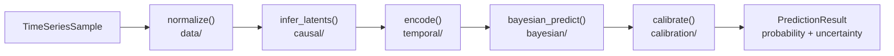
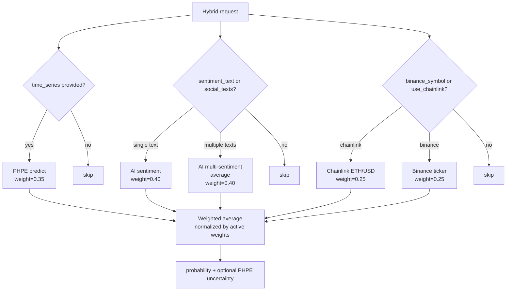

# PHPE and Hybrid Prediction — Technical Reference

The **Praesagium Hybrid Predictive Engine (PHPE)** is a proprietary Rust library that transforms raw time-series data into a calibrated probability with an epistemic uncertainty estimate. It runs entirely off-chain, embedded in the backend process, and feeds the `/api/predict` and `/api/predict/hybrid` endpoints.

This document covers the full PHPE pipeline, the hybrid fusion algorithm, AI provider integration, and the API surface.

---

## 1. Why PHPE Exists

Most prediction market platforms resolve markets using a single oracle signal — a price feed, an AI response, or a manual admin call. PraesagiumChain takes a different approach: before any bet is placed, users can query a **multi-signal probability estimate** that combines:

- Historical time-series patterns (PHPE)
- AI sentiment from news or social text (Gemini / Hugging Face)
- Live price momentum from Binance or Chainlink

The key differentiator is that PHPE produces not just a point estimate (`probability = 0.72`) but also an **uncertainty band** (`uncertainty = 0.14`), which tells users how confident the model is. A market with `probability=0.72, uncertainty=0.04` is very different from one with `probability=0.72, uncertainty=0.38`.

---

## 2. PHPE Pipeline

The full pipeline is defined in [`backend-rust/phpe/src/lib.rs`](../backend-rust/phpe/src/lib.rs). It executes five sequential stages:



The entry point is the `predict()` function:

```rust
pub fn predict(series: &TimeSeriesSample, ctx: &PredictionContext) -> PredictionResult {
    let normalized    = data::normalize(series, &ctx.normalization_params);
    let causal_state  = causal::infer_latents(&normalized, &ctx.causal_graph);
    let embedding     = temporal::encode(&normalized, &causal_state, &ctx.temporal_params);
    let (p, uncert)   = bayesian::predict(&embedding, &ctx.bayesian_params);
    let p_calibrated  = calibration::calibrate(p, &ctx.calibration_params);
    let model_hash    = integration::model_hash(&ctx.model_metadata);

    PredictionResult {
        probability: p_calibrated.clamp(0.0, 1.0),
        uncertainty: uncert.clamp(0.0, 1.0),
        model_version: ctx.model_metadata.version.clone(),
        model_hash,
    }
}
```

Each stage receives the output of the previous one. The `PredictionContext` holds all model parameters and is either generated on-the-fly (`default_context`) or loaded from a serialized JSON file (trained model).

---

## 3. Pipeline Stages in Detail

### 3.1 Data Layer (`data/`)

**Input:** `TimeSeriesSample` — a sequence of `(timestamp, EventFeatures)` pairs.

**`EventFeatures`** is a vector of `f32` values representing the features at each time step (e.g. price, volume, sentiment score). The dimensionality is user-defined.

**`NormalizationParams::from_sample(series)`** computes min-max normalization parameters directly from the input series:

```
normalized_value = (value - min) / (max - min + ε)
```

This ensures all features are in `[0, 1]` before downstream processing. The `ε` prevents division by zero on constant series.

**Output:** A normalized `TimeSeriesSample` with the same structure.

---

### 3.2 Causal Layer (`causal/`)

**Input:** Normalized `TimeSeriesSample`.

**`CausalGraph`** represents a Directed Acyclic Graph (DAG) of latent variable relationships. In the default context, `CausalGraph::empty("0.1.0")` is used — no causal structure is assumed, and the layer acts as a pass-through.

**`infer_latents(series, graph)`** projects the observed features into a latent space guided by the causal structure. When a non-empty graph is provided, it can capture domain-specific relationships (e.g. "volume causes price movement") that improve downstream predictions.

**`CausalState`** carries the latent representation forward to the temporal encoder.

**Output:** `CausalState` — latent representation of the series.

---

### 3.3 Temporal Encoder (`temporal/`)

**Input:** Normalized series + `CausalState`.

The encoder selects a strategy based on `TemporalParams.strategy`:

| Strategy | Activated when | Description |
|----------|---------------|-------------|
| `SlidingWindow(n)` | `series.len() > 10` | Takes the last `n` time steps; captures recent momentum |
| `Mean` | `series.len() <= 10` | Averages all features; stable for short series |
| `RegimeDetection` | Manual config | Detects structural breaks in the series |

The `default_context()` function automatically selects `SlidingWindow(10)` for series longer than 10 points, and `Mean` otherwise:

```rust
let temporal_params = TemporalParams {
    strategy: if series.len() > 10 {
        EncodingStrategy::SlidingWindow(10)
    } else {
        EncodingStrategy::Mean
    },
};
```

**Output:** A fixed-size embedding vector. The embedding dimension is `base_dim * 2 + base_dim * 3`, where `base_dim` is the feature dimensionality of the input.

---

### 3.4 Bayesian Head (`bayesian/`)

**Input:** Embedding vector from the temporal encoder.

**`BayesianParams::from_embedding_dim(dim, n_samples)`** initializes the Bayesian network parameters. The `n_samples` parameter (default: 5) controls the number of Monte Carlo dropout forward passes.

**MC Dropout** is the core technique for uncertainty estimation:
- The same embedding is passed through the network `n_samples` times, each time with random dropout applied.
- The mean of the outputs is the point probability estimate.
- The variance across samples is the epistemic uncertainty proxy.

This approach is computationally cheap compared to full Bayesian inference but provides a meaningful uncertainty signal: high variance across dropout samples indicates the model is uncertain about the input region.

**Output:** `(probability: f32, uncertainty: f32)` — both in `[0, 1]` before calibration.

---

### 3.5 Calibration (`calibration/`)

**Input:** Raw probability from the Bayesian head.

Raw neural network outputs are often overconfident (probabilities cluster near 0 or 1 more than they should). Calibration corrects this.

**`CalibrationParams::default_t1()`** applies **temperature scaling** with `T = 1.0` (identity by default). In a trained model, `T > 1` softens the distribution (reduces overconfidence) and `T < 1` sharpens it.

The library also supports **isotonic regression calibration** (`isotonic_calibration`), which learns a monotone mapping from raw scores to calibrated probabilities using held-out data. This is the recommended approach for production models.

**Output:** Calibrated `probability ∈ [0, 1]`.

---

## 4. PredictionResult — Outputs

```rust
pub struct PredictionResult {
    pub probability:   f32,     // Calibrated probability ∈ [0, 1]
    pub uncertainty:   f32,     // Epistemic uncertainty proxy ∈ [0, 1]
    pub model_version: String,  // Semantic version string (e.g. "0.1.0")
    pub model_hash:    [u8; 32], // SHA-256 of model parameters (auditability)
}
```

| Field | Meaning | Example |
|-------|---------|---------|
| `probability` | Estimated probability that the market resolves Yes | `0.72` |
| `uncertainty` | How uncertain the model is about that estimate | `0.14` |
| `model_version` | Version of the PHPE model used | `"0.1.0"` |
| `model_hash` | 32-byte SHA-256 of model weights — for audit trails | `[0xab, 0x3f, ...]` |

The `model_hash` allows anyone to verify which exact model version produced a given prediction, enabling reproducibility and dispute resolution.

---

## 5. PredictionContext — Default vs. Trained

### 5.1 Default Context (MVP / Demo)

`default_context(series)` generates all parameters on-the-fly from the input series:

```rust
let ctx = default_context(&series);
let result = predict(&series, &ctx);
```

This is suitable for demos and development. The normalization params are derived from the series itself, the causal graph is empty, and the Bayesian weights are randomly initialized.

### 5.2 Trained Context (Production)

For production, a `SavedContext` is serialized to JSON after training and loaded at startup:

```rust
// Save
let saved: SavedContext = ctx.into();
let json = serde_json::to_string(&saved)?;

// Load
let ctx = PredictionContext::try_from(json.as_str())?;
```

The `SavedContext` struct mirrors `PredictionContext` exactly and is fully serializable via `serde`. Storing the context in a file or environment variable allows the backend to load a pre-trained model without retraining on each request.

---

## 6. Hybrid Prediction — Fusion Algorithm

The hybrid predictor is defined in [`backend-rust/src/services/hybrid.rs`](../backend-rust/src/services/hybrid.rs). It fuses up to three independent signals into a single probability.

### 6.1 Default Weights

```rust
pub struct HybridWeights {
    pub series:    f32,  // 0.35 — PHPE time-series engine
    pub sentiment: f32,  // 0.40 — AI sentiment (Gemini / Hugging Face)
    pub price:     f32,  // 0.25 — Live price momentum (Binance or Chainlink)
}
```

### 6.2 Fusion Formula

The fusion is a **weighted average with graceful degradation**: if a source fails or is not provided, it is excluded and the remaining weights are renormalized automatically.

```
prob = Σ(weight_i × prob_i) / Σ(weight_i)
```

For example, if only sentiment and price are available (no time series):

```
prob = (0.40 × p_sentiment + 0.25 × p_price) / (0.40 + 0.25)
     = (0.40 × p_sentiment + 0.25 × p_price) / 0.65
```

If all three sources fail, the function returns `0.5` (maximum uncertainty).

### 6.3 Price → Probability Conversion

Raw price change percentages are converted to probabilities using a **logistic sigmoid**:

```
p_price = 1 / (1 + exp(-0.2 × change_pct))
```

The coefficient `0.2` controls sensitivity. At `change_pct = 0%` (flat), `p = 0.5`. At `change_pct = +10%`, `p ≈ 0.88`. At `change_pct = -10%`, `p ≈ 0.12`.

### 6.4 Sentiment Score → Probability Conversion

AI providers return a raw sentiment score `s ∈ [-1, 1]` (or `[0, 1]` depending on the model). The conversion uses a scaled sigmoid:

```
p_sentiment = 1 / (1 + exp(-2.0 × score))
```

The coefficient `2.0` gives a steeper curve than the price sigmoid, making the sentiment signal more decisive.

### 6.5 Multi-Text Sentiment

When multiple texts are provided (e.g. several tweets or news headlines), the predictor averages their individual sentiment probabilities:

```rust
let avg = texts.iter()
    .filter_map(|t| ai.sentiment(t).ok())
    .map(|(_, p)| p)
    .sum::<f32>() / count as f32;
```

Failed requests are silently excluded from the average.

### 6.6 Full Hybrid Flow



---

## 7. AI Providers

The AI layer is defined in [`backend-rust/src/services/ai/mod.rs`](../backend-rust/src/services/ai/mod.rs) using a trait-based abstraction.

### 7.1 AiProvider Trait

```rust
#[async_trait]
pub trait AiProvider: Send + Sync {
    fn name(&self) -> &'static str;
    async fn sentiment_score(&self, text: &str) -> Result<f32>;
}
```

All providers implement this trait. The `AiService` wraps a provider and adds the score-to-probability conversion:

```rust
pub async fn sentiment(&self, text: &str) -> Result<(f32, f32)> {
    let score = self.provider.sentiment_score(text).await?;
    let prob = 1.0 / (1.0 + (-2.0 * score).exp());
    Ok((score, prob.clamp(0.0, 1.0)))
}
```

### 7.2 Provider Comparison

| Provider | Env vars required | Model | Notes |
|----------|------------------|-------|-------|
| `GeminiProvider` | `GEMINI_API_KEY`, `GEMINI_MODEL` | `gemini-2.0-flash` (default) | Best quality; requires Google AI Studio key |
| `HuggingFaceProvider` | `HF_API_KEY`, `HF_MODEL` | `cardiffnlp/twitter-roberta-base-sentiment` | Open-source; good for social text |
| `MockAiProvider` | none | — | Returns deterministic scores; for tests and local dev |

### 7.3 Provider Selection

The provider is selected at startup in `main.rs` based on the `AI_PROVIDER` environment variable:

```
AI_PROVIDER=gemini      → GeminiProvider (falls back to Mock if GEMINI_API_KEY missing)
AI_PROVIDER=huggingface → HuggingFaceProvider (falls back to Mock if keys missing)
AI_PROVIDER=mock        → MockAiProvider (always)
(default)               → MockAiProvider
```

---

## 8. API Reference

### `POST /api/predict`

Runs the PHPE engine on a raw time series. Returns probability and uncertainty.

**Request body:**

```json
{
  "time_series": [
    { "timestamp": 1700000000, "value": 45000.0 },
    { "timestamp": 1700003600, "value": 45200.0 },
    { "timestamp": 1700007200, "value": 45150.0 }
  ]
}
```

**Response:**

```json
{
  "probability": 0.68,
  "uncertainty": 0.12,
  "model_version": "0.1.0"
}
```

---

### `POST /api/predict/hybrid`

Fuses PHPE + AI sentiment + live price data. All fields are optional; at least one must be provided.

**Request body:**

```json
{
  "time_series": [{ "timestamp": 1700000000, "value": 45000.0 }],
  "sentiment_text": "Bitcoin is showing strong bullish momentum",
  "social_texts": ["BTC to the moon", "Crypto market looking good"],
  "binance_symbol": "BTCUSDT",
  "use_chainlink_price": false,
  "market_id": 1
}
```

| Field | Type | Description |
|-------|------|-------------|
| `time_series` | array | PHPE input; each item has `timestamp` (Unix) and `value` (f64) |
| `sentiment_text` | string | Single text for AI sentiment analysis |
| `social_texts` | array of strings | Multiple texts; sentiments are averaged |
| `binance_symbol` | string | Binance ticker symbol (e.g. `"BTCUSDT"`, `"ETHUSDT"`) |
| `use_chainlink_price` | bool | If true, fetches ETH/USD from Chainlink proxy instead of Binance |
| `market_id` | number | If provided, stores the prediction in the DB for this market |

**Response:**

```json
{
  "probability": 0.74,
  "uncertainty": 0.09,
  "market_id": 1
}
```

`uncertainty` is only present when `time_series` was provided (it comes from PHPE).

---

### `POST /api/ai/sentiment`

Runs only the AI sentiment analysis. No PHPE or price data.

**Request:**

```json
{ "text": "Ethereum upgrade looks very promising for DeFi" }
```

**Response:**

```json
{
  "provider": "gemini",
  "sentiment_score": 0.82,
  "probability": 0.91
}
```

---

### `POST /api/markets/:id/ai/predict`

Same as `/api/ai/sentiment` but scoped to a specific market. The result is stored in the DB.

---

## 9. Intellectual Property

PHPE combines several proprietary techniques in a novel configuration:

- **Hybrid fusion with graceful degradation** — the weighted average with automatic renormalization when sources fail is not standard in existing prediction market platforms.
- **Calibrated epistemic uncertainty** — exposing `uncertainty` alongside `probability` to end users is unique in the decentralized prediction market space.
- **Modular pipeline** — each stage (normalize, causal, temporal, Bayesian, calibrate) is independently testable and replaceable, enabling incremental improvement without retraining the full model.
- **On-chain / off-chain boundary** — PHPE runs off-chain and feeds the CRE resolution layer via a well-defined API contract, maintaining trustlessness while enabling complex computation.

The combination of these techniques in a decentralized prediction market context may be patentable. Maintain design documentation, benchmark comparisons with baseline methods, and dated records of the original implementation. Consult a patent attorney before public disclosure of implementation details beyond what is in this repository.
