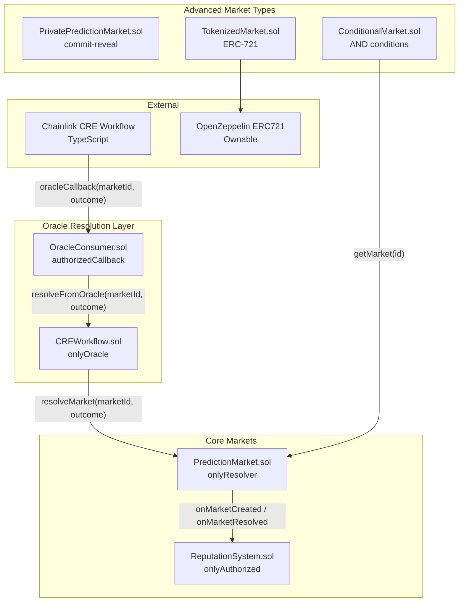
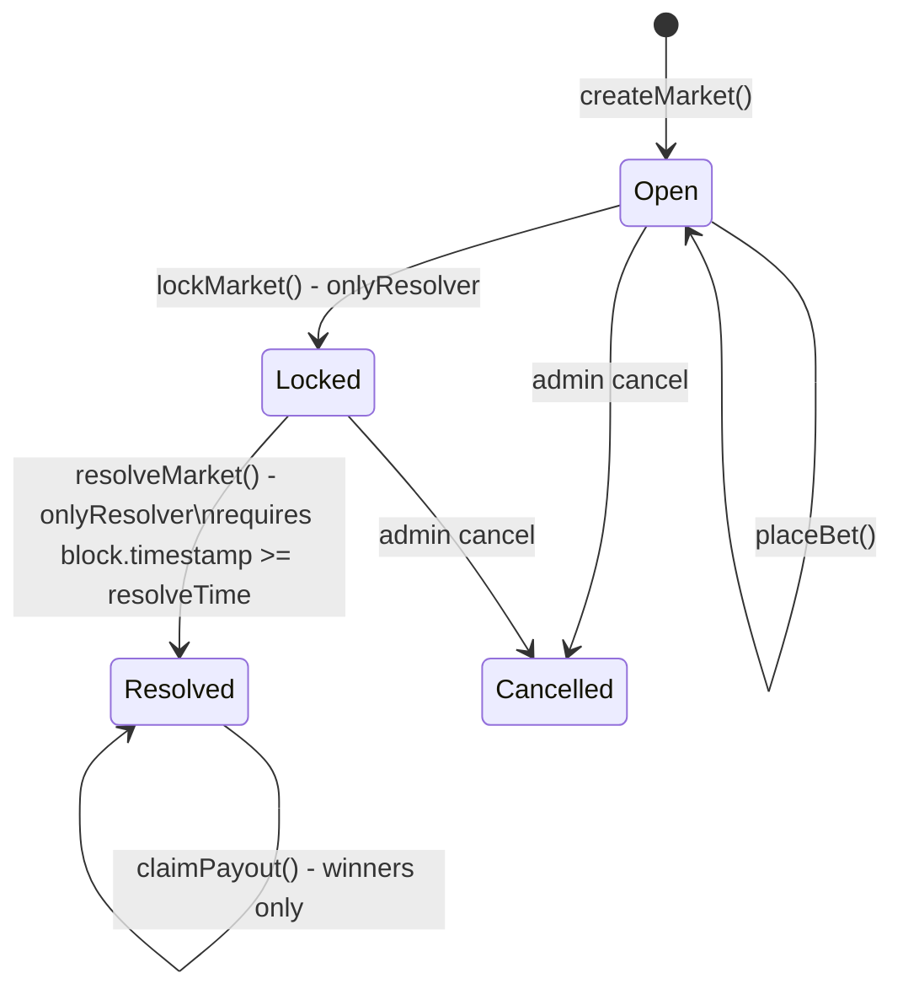
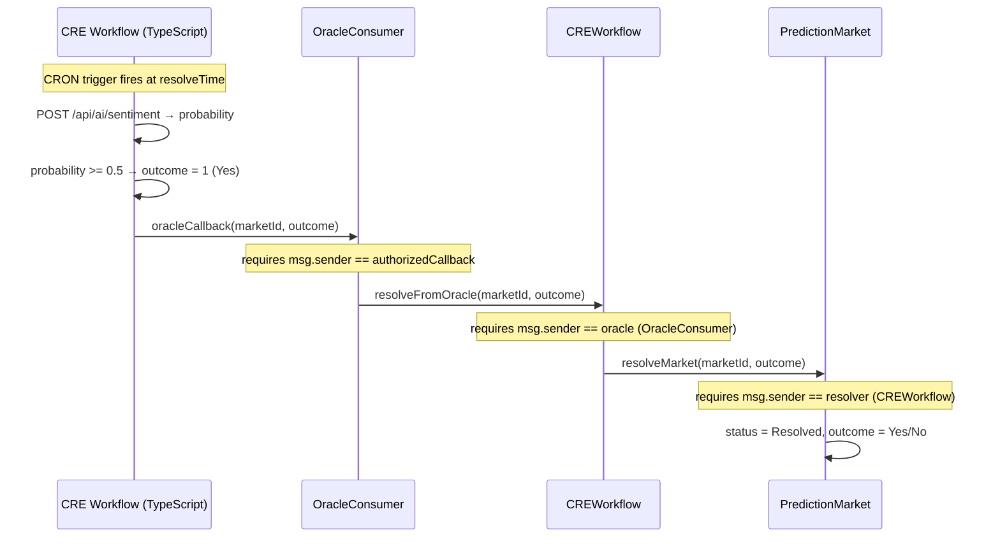
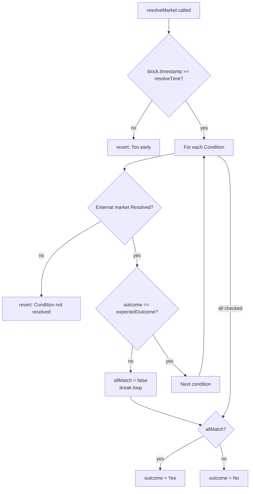
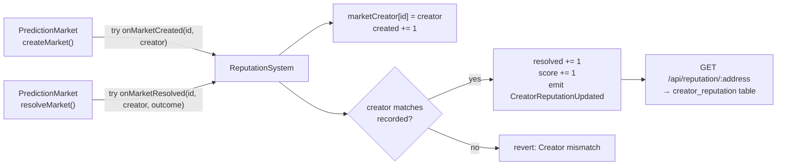
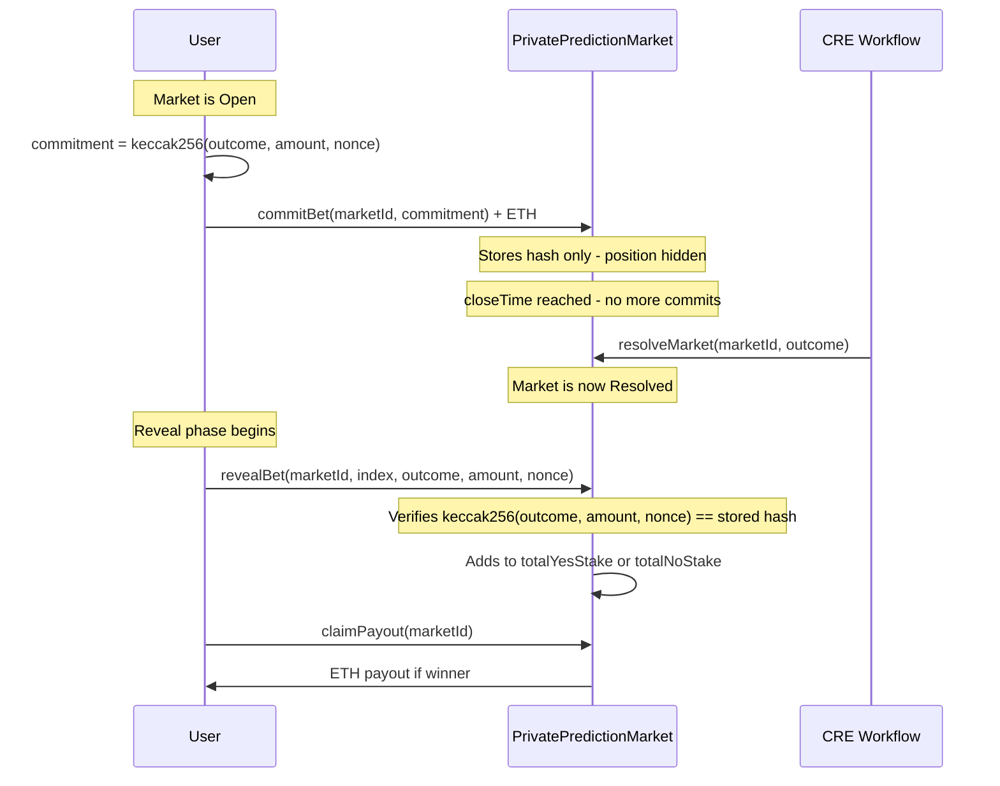
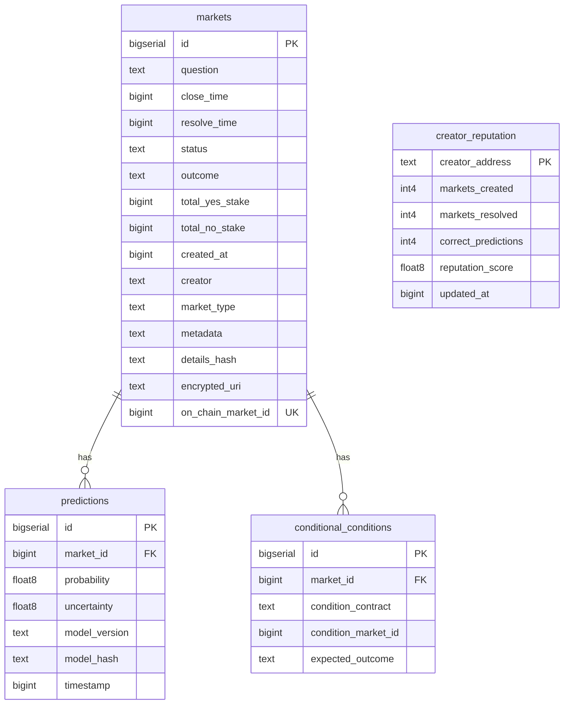
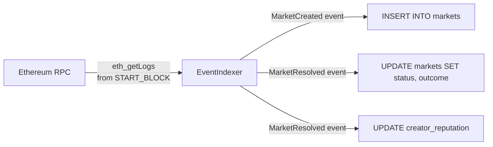

# Smart Contracts and Database — Technical Reference

This document provides a complete technical reference for all PraesagiumChain smart contracts, their interactions, the oracle resolution flow, and the database schema. It is intended for developers integrating with the contracts or extending the backend.

---

## 1. Contract Map

PraesagiumChain deploys seven contracts across three functional groups:



### Contract Addresses (Sepolia Testnet)

| Contract | Address |
|----------|---------|
| PredictionMarket | `0xf2397b5827860b361427240d1D1F6F89e9bF197f` |
| CREWorkflow | `0x3724BD048C11f50e01900061D8D50022A7c890c7` |
| OracleConsumer | `0x153D088Eabb57b021503Aa1192F511B14e8819D8` |

---

## 2. PredictionMarket.sol — Core Contract

**File:** [`contracts/PredictionMarket.sol`](../contracts/PredictionMarket.sol)

The base contract for all standard binary prediction markets. It manages the full lifecycle from creation to payout.

### 2.1 Roles

| Role | Address | Capabilities |
|------|---------|-------------|
| `owner` | Deployer | Set resolver, set reputation system |
| `resolver` | CREWorkflow address | Lock markets, resolve markets |

### 2.2 Enums

```solidity
enum MarketStatus { Open, Locked, Resolved, Cancelled }
// Values:          0      1       2          3

enum Outcome { Undecided, Yes, No }
// Values:     0           1    2
```

### 2.3 Functions

| Function | Caller | Description |
|----------|--------|-------------|
| `createMarket(question, closeTime, resolveTime)` | Anyone | Creates a new binary market; emits `MarketCreated` |
| `placeBet(marketId, outcome)` | Anyone | Places ETH bet on Yes(1) or No(2); requires `msg.value > 0` and market Open |
| `lockMarket(marketId)` | `onlyResolver` | Transitions market from Open → Locked |
| `resolveMarket(marketId, outcome)` | `onlyResolver` | Resolves market; requires `block.timestamp >= resolveTime` |
| `claimPayout(marketId)` | Anyone | Claims proportional payout for winners; `nonReentrant` |
| `getMarket(marketId)` | View | Returns `MarketView` struct |
| `getUserStake(marketId, user)` | View | Returns `(yesStake, noStake)` for a user |

### 2.4 Market Lifecycle



### 2.5 Payout Formula

Winners receive a proportional share of the total pool:

```
payout = (userWinningStake × totalPool) / totalWinningStake

where totalPool = totalYesStake + totalNoStake
```

Example: market resolves Yes, total pool = 1 ETH, total Yes stake = 0.6 ETH, user Yes stake = 0.2 ETH:

```
payout = (0.2 × 1.0) / 0.6 = 0.333 ETH
```

### 2.6 Events

| Event | Emitted when |
|-------|-------------|
| `MarketCreated(marketId, question, closeTime, resolveTime, creator)` | `createMarket()` succeeds |
| `BetPlaced(marketId, user, outcome, amount)` | `placeBet()` succeeds |
| `MarketLocked(marketId)` | `lockMarket()` called |
| `MarketResolved(marketId, outcome, totalYesStake, totalNoStake)` | `resolveMarket()` called |
| `PayoutClaimed(marketId, user, amount)` | `claimPayout()` succeeds |

### 2.7 Reputation Hook Integration

`PredictionMarket` calls `ReputationSystem` hooks via `try/catch` (best-effort — a reputation failure never blocks market operations):

```solidity
try reputationSystem.onMarketCreated(marketId, msg.sender) {} catch {}
try reputationSystem.onMarketResolved(marketId, m.creator, uint8(outcome)) {} catch {}
```

---

## 3. OracleConsumer.sol + CREWorkflow.sol — Resolution Flow

**Files:** [`contracts/OracleConsumer.sol`](../contracts/OracleConsumer.sol), [`contracts/CREWorkflow.sol`](../contracts/CREWorkflow.sol)

These two contracts form the bridge between the Chainlink CRE off-chain workflow and the on-chain market resolution. The three-contract design (OracleConsumer → CREWorkflow → PredictionMarket) provides separation of concerns: each contract can be upgraded independently.

### 3.1 Resolution Sequence



### 3.2 Access Control Chain

```
CRE TypeScript workflow
  → OracleConsumer.oracleCallback()   [restricted to: authorizedCallback]
    → CREWorkflow.resolveFromOracle() [restricted to: onlyOracle = OracleConsumer]
      → PredictionMarket.resolveMarket() [restricted to: onlyResolver = CREWorkflow]
```

Each hop has its own access control. To set up the chain after deployment:

```javascript
// 1. Set OracleConsumer as the resolver in PredictionMarket
await predictionMarket.setResolver(oracleConsumer.address);

// 2. Set CREWorkflow as the oracle in OracleConsumer
// (done automatically by deployLocal.js via setAuthorizedCallback)
await oracleConsumer.setAuthorizedCallback(deployerAddress); // local demo
// In production: setAuthorizedCallback(chainlinkFunctionsRouterAddress)

// 3. Set OracleConsumer as the oracle in CREWorkflow
await creWorkflow.setOracle(oracleConsumer.address);
```

### 3.3 Who Calls `oracleCallback` in Production?

The CRE workflow in this repo (`cre/praesagium-resolver/main.ts`) runs on a CRON trigger, calls the backend `/api/ai/sentiment`, and **computes** the outcome (0/1). It does **not** send an on-chain transaction itself; it only logs the intended call when `oracle_consumer_address` is set in config.

To complete the resolution on-chain in production, use one of these options:

| Option | Description |
|--------|-------------|
| **Chainlink CRE executor** | When the Chainlink CRE runtime supports submitting transactions, configure the workflow so the executor calls `OracleConsumer.oracleCallback(marketId, outcome)` with the workflow result. Set `oracle_consumer_address` in the CRE config to the deployed `OracleConsumer` address. |
| **`scripts/resolveFromBackend.js`** | Run as a cron job or via Chainlink Automation at resolve time. It fetches the outcome from the API (e.g. `/api/ai/sentiment` or `/api/price/above`) and sends the transaction to `OracleConsumer.oracleCallback(marketId, outcome)` using a wallet funded with gas. Requires `ORACLE_CONSUMER_ADDRESS`, `PRIVATE_KEY`, and `API_BASE_URL`. |
| **Custom resolver service** | A dedicated service that subscribes to “market due for resolution” (e.g. from a queue or DB) and calls the API for the outcome, then submits the tx (with retries and idempotency by `market_id`). |

Ensure `OracleConsumer.setAuthorizedCallback()` is set to the address that will send the transaction (CRE executor, Automation node, or your resolver wallet). For local demos, the deploy script sets the deployer as `authorizedCallback`; for production, use the Chainlink Functions Router or the address of your Automation / resolver service.

### 3.4 Why Three Contracts

| Concern | Contract |
|---------|---------|
| Receiving the oracle signal | OracleConsumer |
| Translating oracle signal to market action | CREWorkflow |
| Market state and funds | PredictionMarket |

This separation allows, for example, replacing `OracleConsumer` with a Chainlink Functions consumer without touching `PredictionMarket` or user funds.

---

## 4. ConditionalMarket.sol — Chained Conditions

**File:** [`contracts/ConditionalMarket.sol`](../contracts/ConditionalMarket.sol)

`ConditionalMarket` resolves based on the outcomes of other prediction markets. It implements AND logic: all conditions must be met for the market to resolve Yes.

### 4.1 Condition Struct

```solidity
struct Condition {
    address marketContract;   // Address of the external IPredictionMarket
    uint256 marketId;         // Market ID within that contract
    Outcome expectedOutcome;  // Yes or No
}
```

### 4.2 Creating a Conditional Market

```solidity
function createConditionalMarket(
    string calldata question,
    uint256 closeTime,
    uint256 resolveTime,
    Condition[] calldata conditions
) external returns (uint256 marketId)
```

Conditions are stored in the market struct and emitted as `ConditionAdded` events.

### 4.3 Resolution Logic

`resolveMarket(marketId)` is called by the resolver after `resolveTime`. It iterates all conditions:



```solidity
for (uint256 i = 0; i < m.conditions.length; i++) {
    IPredictionMarket.MarketView memory ext =
        IPredictionMarket(c.marketContract).getMarket(c.marketId);

    // All conditions must be Resolved before this market can resolve
    require(ext.status == IPredictionMarket.MarketStatus.Resolved, "Condition not resolved");

    Outcome extOutcome = ext.outcome == IPredictionMarket.Outcome.Yes
        ? Outcome.Yes : Outcome.No;

    if (extOutcome != c.expectedOutcome) {
        allMatch = false;
        break;
    }
}

m.outcome = allMatch ? Outcome.Yes : Outcome.No;
```

**Result:** `Yes` only if every condition market is resolved AND its outcome matches the expected outcome. Any mismatch → `No`.

### 4.4 Use Cases

| Question | Conditions |
|----------|-----------|
| "Will ETH > $5k AND BTC > $100k by Dec 31?" | `[ETH_market.Yes, BTC_market.Yes]` |
| "Will Team A win AND the game go to overtime?" | `[winner_market.Yes, overtime_market.Yes]` |
| "Will it rain in NYC OR London?" | Not supported natively (AND only); use separate markets |

---

## 5. TokenizedMarket.sol — NFT Markets

**File:** [`contracts/TokenizedMarket.sol`](../contracts/TokenizedMarket.sol)

`TokenizedMarket` extends the standard market with ERC-721 tokenization. Each market creation mints an NFT to the creator, where the **token ID equals the market ID**.

### 5.1 Inheritance

```solidity
contract TokenizedMarket is ERC721("Praesagium Market", "PRSMKT"), Ownable
```

- Token name: `Praesagium Market`
- Token symbol: `PRSMKT`
- Token ID = Market ID (1:1 mapping)

### 5.2 Mint on Creation

```solidity
function createMarket(string calldata question, uint256 closeTime, uint256 resolveTime)
    external returns (uint256 marketId)
{
    marketId = _nextMarketId++;
    _markets[marketId] = Market({ ... });
    _safeMint(msg.sender, marketId);           // Mint NFT to creator
    emit MarketTokenized(marketId, msg.sender, msg.sender);
    emit MarketCreated(marketId, question, closeTime, resolveTime, msg.sender);
}
```

### 5.3 NFT Semantics

The NFT represents **market provenance**, not governance rights. The token is transferable via standard ERC-721 transfers. Whoever holds the token can prove they created (or acquired) the market.

In the current implementation, the NFT holder has no special on-chain privileges beyond provenance. Future versions could grant the token holder fee revenue or resolution authority.

### 5.4 Use Cases

- **Market ownership marketplace** — creators can sell their markets as NFTs
- **Provenance verification** — prove which address originated a market
- **Reputation NFTs** — combine with `ReputationSystem` to create verifiable creator credentials

---

## 6. ReputationSystem.sol — On-Chain Creator Reputation

**File:** [`contracts/ReputationSystem.sol`](../contracts/ReputationSystem.sol)

`ReputationSystem` tracks market creator statistics on-chain. It is called by `PredictionMarket` via hooks and can be queried by anyone.

### 6.1 Data Structure

```solidity
struct CreatorStats {
    uint256 created;   // Total markets created
    uint256 resolved;  // Total markets resolved
    uint256 score;     // Reputation score (increments +1 per resolved market)
}
```

### 6.2 Authorization Model

Only contracts registered in `authorizedCallers` can call the hooks:

```solidity
mapping(address => bool) public authorizedCallers;

modifier onlyAuthorized() {
    require(authorizedCallers[msg.sender], "Not authorized");
    _;
}
```

The owner calls `setAuthorizedCaller(predictionMarketAddress, true)` after deployment.

### 6.3 Hook Functions

**`onMarketCreated(marketId, creator)`**
- Records `marketCreator[marketId] = creator`
- Increments `_stats[creator].created`
- Emits `MarketCreatorRegistered(marketId, creator)`

**`onMarketResolved(marketId, creator, outcome)`**
- Verifies `creator` matches the recorded creator (anti-spoofing)
- Increments `_stats[creator].resolved` and `_stats[creator].score` (+1)
- Emits `CreatorReputationUpdated(creator, newScore)`



### 6.4 Anti-Spoofing

If `onMarketCreated` was called first, `onMarketResolved` verifies the creator matches:

```solidity
address recorded = marketCreator[marketId];
if (recorded != address(0)) {
    require(recorded == creator, "Creator mismatch");
}
```

This prevents a malicious caller from claiming resolution credit for a market they did not create.

### 6.5 Reading Reputation

```solidity
function getCreatorStats(address creator)
    external view
    returns (uint256 marketsCreated, uint256 marketsResolved, uint256 reputationScore)
```

The backend mirrors this data in the `creator_reputation` table (see §8) and exposes it via `GET /api/reputation/:address`.

---

## 7. PrivatePredictionMarket.sol — Commit-Reveal Markets

**File:** [`contracts/PrivatePredictionMarket.sol`](../contracts/PrivatePredictionMarket.sol)

### 7.0 Commit-Reveal Flow



### 7.1 Commitment Scheme

Users commit a hash of their intended bet before the market closes:

```solidity
function commitBet(uint256 marketId, bytes32 commitment) external payable
// commitment = keccak256(abi.encode(outcome, amount, nonce))
```

The `nonce` is a secret known only to the user, preventing front-running and position inference.

### 7.2 Reveal Phase

After resolution, users reveal their commitment to claim:

```solidity
function revealBet(
    uint256 marketId,
    uint256 index,     // Index in the user's commitment array
    uint8 outcome,     // 1=Yes, 2=No
    uint256 amount,    // ETH amount
    bytes32 nonce      // Secret nonce
) external
```

The contract verifies `keccak256(abi.encode(outcome, amount, nonce)) == stored_commitment`. If valid, the revealed stake is added to `totalYesStake` or `totalNoStake`.

### 7.3 Payout

`claimPayout(marketId)` uses the revealed stakes (not the committed ETH) to compute proportional payouts. The total committed ETH is the pool.

---

## 8. Database Schema

**File:** `backend-rust/migrations_pg/`

The database schema mirrors on-chain state and stores off-chain data (predictions, reputation). The backend's `EventIndexer` keeps it synchronized with the blockchain.

> **Database engine:** The backend uses **PostgreSQL** only. Set `DATABASE_URL=postgresql://...` in `.env`. Migrations are in `backend-rust/migrations_pg/` and are applied automatically by SQLx on backend startup.

### 8.1 Entity Relationship



### 8.2 Table: `markets`

| Column | Type | Description |
|--------|------|-------------|
| `id` | `BIGSERIAL PK` | Internal auto-increment ID |
| `question` | `TEXT NOT NULL` | Market question |
| `close_time` | `BIGINT NOT NULL` | Unix timestamp — betting closes |
| `resolve_time` | `BIGINT NOT NULL` | Unix timestamp — resolution allowed |
| `status` | `TEXT DEFAULT 'Open'` | `Open` \| `Locked` \| `Resolved` \| `Cancelled` |
| `outcome` | `TEXT` | `Yes` \| `No` \| `null` (before resolution) |
| `total_yes_stake` | `BIGINT DEFAULT 0` | Total ETH staked on Yes (in wei) |
| `total_no_stake` | `BIGINT DEFAULT 0` | Total ETH staked on No (in wei) |
| `created_at` | `BIGINT NOT NULL` | Unix timestamp of creation |
| `creator` | `TEXT` | Ethereum address of creator |
| `market_type` | `TEXT DEFAULT 'base'` | `base` \| `conditional` \| `private` \| `tokenized` |
| `metadata` | `TEXT` | Arbitrary JSON metadata |
| `details_hash` | `TEXT` | IPFS hash or content hash of market details |
| `encrypted_uri` | `TEXT` | Encrypted URI for private market details |
| `on_chain_market_id` | `BIGINT UNIQUE` | Market ID from the smart contract (sync key) |

The `on_chain_market_id` is the critical sync field. When the `EventIndexer` detects a `MarketCreated` event, it inserts a row with this field set to the contract's market ID. Subsequent updates (status changes, stake updates) use this field to find the correct row.

### 8.3 Table: `predictions`

| Column | Type | Description |
|--------|------|-------------|
| `id` | `BIGSERIAL PK` | Auto-increment |
| `market_id` | `BIGINT FK → markets.id` | Which market this prediction is for |
| `probability` | `FLOAT8 NOT NULL` | PHPE probability ∈ [0, 1] |
| `uncertainty` | `FLOAT8` | PHPE uncertainty ∈ [0, 1] (null if not from PHPE) |
| `model_version` | `TEXT` | PHPE model version string |
| `model_hash` | `TEXT` | Hex-encoded SHA-256 of model parameters |
| `timestamp` | `BIGINT NOT NULL` | Unix timestamp of prediction |

Multiple predictions can exist per market, forming a **prediction history**. The frontend can plot probability over time to show how the PHPE estimate evolved as new data arrived.

### 8.4 Table: `conditional_conditions`

| Column | Type | Description |
|--------|------|-------------|
| `id` | `BIGSERIAL PK` | Auto-increment |
| `market_id` | `BIGINT FK → markets.id` | The conditional market |
| `condition_contract` | `TEXT NOT NULL` | Address of the external market contract |
| `condition_market_id` | `BIGINT NOT NULL` | Market ID within that contract |
| `expected_outcome` | `TEXT NOT NULL` | `Yes` or `No` |

This table is the off-chain mirror of the `Condition[]` array stored in `ConditionalMarket.sol`. It allows the backend to display conditions without making on-chain calls.

### 8.5 Table: `creator_reputation`

| Column | Type | Description |
|--------|------|-------------|
| `creator_address` | `TEXT PK` | Ethereum address (checksummed) |
| `markets_created` | `INT4 DEFAULT 0` | Total markets created |
| `markets_resolved` | `INT4 DEFAULT 0` | Total markets resolved |
| `correct_predictions` | `INT4 DEFAULT 0` | Markets where PHPE predicted correctly |
| `reputation_score` | `FLOAT8 DEFAULT 0` | Composite score (updated by ReputationService) |
| `updated_at` | `BIGINT NOT NULL` | Unix timestamp of last update |

This table is an off-chain mirror of `ReputationSystem.sol`. The `ReputationService` in the backend updates it when the `EventIndexer` detects `MarketResolved` events. The `correct_predictions` field is computed off-chain by comparing the PHPE prediction at close time with the final outcome.

### 8.6 Indexes

| Index | Table | Column | Purpose |
|-------|-------|--------|---------|
| `idx_markets_status` | `markets` | `status` | Fast filtering by Open/Resolved/etc. |
| `idx_predictions_market_id` | `predictions` | `market_id` | Fast lookup of prediction history per market |
| `idx_conditions_market_id` | `conditional_conditions` | `market_id` | Fast lookup of conditions per market |
| `idx_creator_reputation_score` | `creator_reputation` | `reputation_score` | Fast leaderboard queries |

---

## 9. On-Chain / Off-Chain Synchronization

The `EventIndexer` (defined in `backend-rust/src/services/indexer.rs`) is an optional background task that keeps the database in sync with the blockchain.

### 9.1 How It Works



The indexer polls for new blocks at a configurable interval. It processes `MarketCreated` and `MarketResolved` events from the `PredictionMarket` contract.

### 9.2 Configuration

```env
RPC_URL=https://eth-sepolia.g.alchemy.com/v2/YOUR_KEY
PREDICTION_MARKET_ADDRESS=0xf2397b5827860b361427240d1D1F6F89e9bF197f
START_BLOCK=7000000   # Block to start indexing from (saves time on initial sync)
```

If `RPC_URL` or `PREDICTION_MARKET_ADDRESS` is not set, the indexer does not start and the backend operates in API-only mode.

### 9.3 Source of Truth

The blockchain is always the source of truth. The database is a read-optimized cache. If the indexer is down or behind:

- On-chain state can be read directly via `getMarket(id)` and `getUserStake(id, address)`
- The frontend should fall back to on-chain reads when the API returns stale data
- The `on_chain_market_id` field in `markets` is the key for reconciliation

### 9.4 Manual Sync

To re-sync a specific market from the chain, the backend exposes `PATCH /api/markets/:id/status` which allows updating the status and outcome fields directly. This is used by the demo scripts after calling `resolveFromBackend.js`.

---

## 10. Backups and Restore

For production, back up the database regularly so you can restore after failure or migration.

### 10.1 Backup Script

From the repo root, run:

```bash
./scripts/backup-db.sh [output_dir]
```

- **output_dir** (optional): directory where backup files are written. Default: `./backups`.
- **DATABASE_URL** must be set (e.g. in `.env`).

Behavior:

- **PostgreSQL:** uses `pg_dump` with `--no-owner --no-acl`. Output: `praesagium-postgres-YYYYMMDD-HHMMSS.sql`.

Schedule this script via cron (e.g. daily) and retain a retention policy (e.g. keep last 7 days).

### 10.2 Restore

- **PostgreSQL:** create a new database if needed, then `psql $DATABASE_URL -f praesagium-postgres-YYYYMMDD-HHMMSS.sql`.

After restore, ensure `RPC_URL` and `PREDICTION_MARKET_ADDRESS` are set so the indexer can catch up with any blocks missed during downtime.

